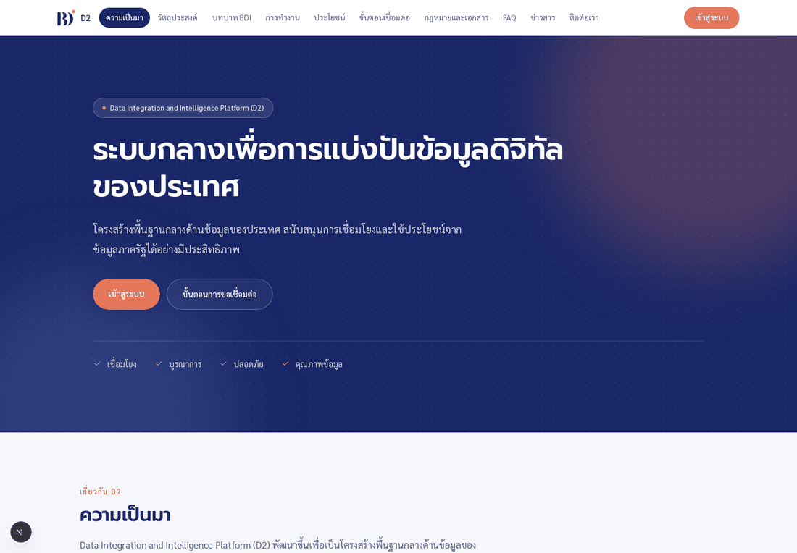
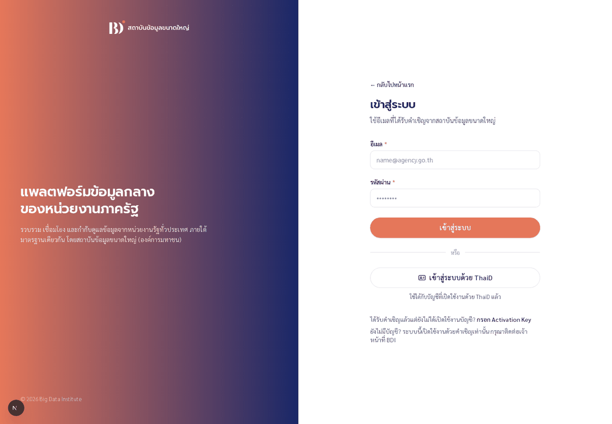
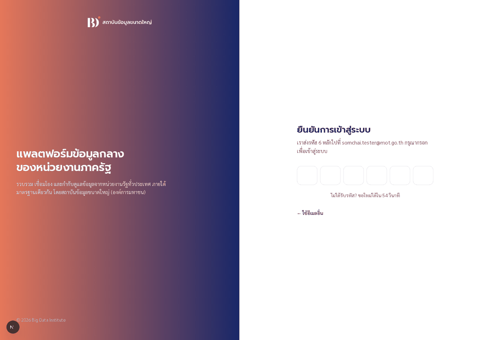
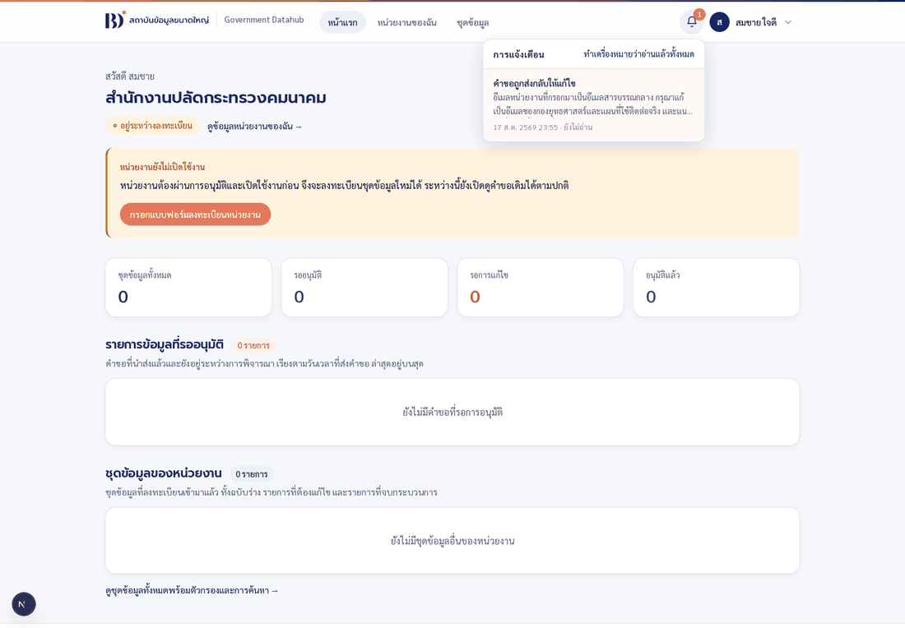

# คู่มือผู้ทดสอบระบบ — ภาพรวมและการเข้าใช้งาน

คู่มือชุดนี้ทำไว้ให้ **ผู้ทดสอบระบบ** ที่ยังไม่เคยเห็น Government Datahub Platform มาก่อน
ไม่ต้องมีพื้นฐานทางเทคนิค อ่านแล้วทำตามทีละข้อได้เลย ภาพหน้าจอทุกภาพถ่ายมาจากระบบจริง
ไม่ได้วาดขึ้นใหม่ ดังนั้นสิ่งที่คุณเห็นบนจอควรตรงกับในคู่มือ

คู่มือมีทั้งหมดสี่เล่ม

| เล่ม | เนื้อหา | ใครควรอ่าน |
| --- | --- | --- |
| **เล่มนี้** | ภาพรวมระบบ · บัญชีทดสอบ · วิธีเข้าสู่ระบบ · การแจ้งเตือน · ปัญหาที่พบบ่อย | ทุกคน |
| [เล่ม A](13-tester-manual-journey-a.md) | ผู้ดูแลระบบสร้างหน่วยงานและส่งคำเชิญ | ผู้ดูแลระบบ (มีคำสั่งให้พิมพ์) |
| [เล่ม B](14-tester-manual-journey-b.md) | หน่วยงานลงทะเบียนตัวเองจนได้รับอนุมัติ | ผู้ทดสอบทั่วไป |
| [เล่ม C](15-tester-manual-journey-c.md) | หน่วยงานลงทะเบียนชุดข้อมูลจนได้รับอนุมัติ | ผู้ทดสอบทั่วไป |

> **เริ่มยังไงดี** — อ่านเล่มนี้ให้จบก่อน แล้วข้ามไปเล่ม B ได้เลย เพราะเล่ม B กับ C
> ต่อกันเป็นเรื่องเดียว ส่วนเล่ม A คือสิ่งที่ผู้ดูแลระบบทำให้คุณตั้งแต่ก่อนคุณจะมีบัญชี
> ถ้าคุณไม่ใช่ผู้ดูแลระบบ อ่านแค่ข้อ 5–7 ของเล่ม A ก็พอ

---

## 1. ระบบนี้คืออะไร

Government Datahub Platform เป็นระบบกลางที่ให้ **หน่วยงานภาครัฐ** เข้ามาลงทะเบียนหน่วยงานของตัวเอง
แล้วนำ **ชุดข้อมูล** ที่หน่วยงานดูแลอยู่มาลงทะเบียนไว้ที่ส่วนกลาง ทุกอย่างที่ส่งเข้ามาต้องผ่าน
การตรวจสอบและอนุมัติเป็นขั้น ๆ ไม่มีอะไรที่กดส่งแล้วเข้าระบบทันที



*หน้าแรกก่อนเข้าสู่ระบบ — กด **เข้าสู่ระบบ** ที่มุมขวาบนเพื่อเริ่ม*

### ภาพรวมทั้งหมด แบ่งเป็นสามตอน

```
ตอน A   ผู้ดูแลระบบสร้าง "หน่วยงาน" ไว้ให้ล่วงหน้า แล้วส่งคำเชิญมาที่อีเมลของคุณ
             ↓
ตอน B   คุณเปิดใช้งานบัญชี → กรอกแบบฟอร์มลงทะเบียนหน่วยงาน → ผ่านการตรวจ 3 ด่าน
             ↓   หน่วยงานเปิดใช้งานแล้ว
ตอน C   คุณลงทะเบียนชุดข้อมูล → ผ่านการตรวจ 3–4 ด่าน → ได้เอกสารฉบับอนุมัติ
```

### ในเรื่องนี้มีใครบ้าง

| บทบาท | ทำหน้าที่อะไร | อยู่ฝั่งไหน |
| --- | --- | --- |
| **ผู้ดำเนินการของหน่วยงาน** | กรอกแบบฟอร์มลงทะเบียนหน่วยงาน และกรอกคำขอลงทะเบียนชุดข้อมูล | หน่วยงานของคุณ |
| **ผู้มีอำนาจกระทำการแทน** | ตรวจเอกสารแล้วกด "เห็นชอบและลงนาม" ในนามหน่วยงาน | หน่วยงานของคุณ |
| **เจ้าหน้าที่ BDI** | ตรวจความถูกต้อง แล้วส่งกลับให้แก้หรือส่งต่อไปด่านถัดไป | BDI |
| **ผู้เชี่ยวชาญข้อมูล BDI** | ตรวจเนื้อหาของชุดข้อมูล เฉพาะรายการที่ถูกมอบหมายให้ | BDI |
| **ผู้อนุมัติ BDI** | ลงนามอนุมัติเป็นด่านสุดท้าย | BDI |

> **แต่ละหน่วยงานมีผู้ดำเนินการได้ครั้งละหนึ่งคน และมีผู้มีอำนาจกระทำการแทนได้ครั้งละหนึ่งคน**
> ถ้าต้องการเปลี่ยนตัว ให้ผู้ดูแลระบบยกเลิกสิทธิ์ของคนเดิมก่อน

---

## 2. ก่อนเริ่มทดสอบ ต้องเตรียมอะไร

ขอสามอย่างนี้จาก **ผู้ดูแลระบบ** ก่อน

1. **บัญชีสำหรับเข้าใช้งาน** — ผู้ดูแลระบบเป็นคนสร้างให้ ระบบนี้สมัครเองไม่ได้
2. **อีเมลจริงที่คุณเปิดอ่านได้** เพราะระบบส่งรหัส OTP ไปที่อีเมลนั้นทุกครั้งที่เข้าสู่ระบบ
   (ดูข้อ 4 ว่าทำไมเรื่องนี้สำคัญกว่าที่คิด)

### ระบบอยู่ที่ไหน

| ส่วน | ที่อยู่ |
| --- | --- |
| **หน้าเว็บ — ใช้อันนี้เป็นหลัก** | <https://bdi.thammasorn.org> |
| API (เฉพาะผู้ดูแลระบบ ดูเล่ม A) | <https://bdi-api.thammasorn.org> |

> ภาพหน้าจอในคู่มือถ่ายจากเครื่องพัฒนา หน้าตาและปุ่มทุกอย่างตรงกับที่คุณจะเห็นบน
> `bdi.thammasorn.org` ทุกประการ ต่างกันแค่ที่อยู่บนแถบเบราว์เซอร์เท่านั้น

### บัญชีตัวอย่างที่มีอยู่แล้ว

ถ้าผู้ดูแลระบบใส่ข้อมูลตัวอย่าง (seed) ไว้ให้ จะมีบัญชีชุดนี้พร้อมใช้ทันที
**ทุกบัญชีใช้รหัสผ่านเดียวกันคือ `bdi12345`**

| อีเมล | บทบาท |
| --- | --- |
| `officer@bdi.or.th` | เจ้าหน้าที่ BDI — เห็นและตรวจได้ทุกคำขอในระบบ |
| `approver@bdi.or.th` | ผู้อนุมัติ BDI — ลงนามด่านสุดท้าย |
| `specialist@bdi.or.th` | ผู้เชี่ยวชาญข้อมูล BDI |
| `user@nso.go.th` | ผู้ดำเนินการของสำนักงานสถิติแห่งชาติ (หน่วยงานนี้เปิดใช้งานแล้ว) |
| `director@nso.go.th` | ผู้มีอำนาจกระทำการแทนของสำนักงานสถิติแห่งชาติ |
| `newbie@moi.go.th` | คนที่เพิ่งรับคำเชิญ ยังไม่ได้เริ่มกรอกแบบฟอร์มหน่วยงาน |

> **เคล็ดลับที่ช่วยได้มาก** — ระหว่างทดสอบคุณต้องสลับบัญชีบ่อยมาก
> (ผู้กรอก → เจ้าหน้าที่ → ผู้ลงนาม → ผู้อนุมัติ) แนะนำให้เปิด
> **หน้าต่างไม่ระบุตัวตน (Incognito) แยกกันคนละหน้าต่างต่อหนึ่งบทบาท**
> จะได้ไม่ต้องออกจากระบบแล้วเข้าใหม่ทุกครั้ง

---

## 3. วิธีเข้าสู่ระบบ

ระบบนี้ **สมัครเองไม่ได้** ทุกบัญชีเกิดจากคำเชิญของผู้ดูแลระบบเท่านั้น
เมื่อมีบัญชีแล้ว เข้าสู่ระบบได้สองทาง

### ทางที่ 1 — อีเมล + รหัสผ่าน + รหัส OTP



1. กรอก **อีเมล** กับ **รหัสผ่าน** แล้วกด **เข้าสู่ระบบ**
2. ระบบจะยังไม่ให้เข้า แต่จะส่ง **รหัส 6 หลัก** ไปที่อีเมลนั้นก่อน



3. กรอกรหัส 6 หลักลงในช่อง (จะคัดลอกมาวางทั้งชุดทีเดียวก็ได้)
   ครบ 6 หลักเมื่อไร ระบบพาเข้าให้เอง **ไม่ต้องกดปุ่มอะไรเพิ่ม**

สิ่งที่ต้องรู้เกี่ยวกับรหัส OTP

- รหัสหนึ่งชุดใช้ได้ **10 นาที**
- กรอกผิดได้ **5 ครั้ง** ถ้าเกินกว่านั้นต้องกดขอรหัสใหม่
- ปุ่มขอรหัสใหม่ต้องรอ **60 วินาที** ระหว่างนั้นหน้าจอจะนับถอยหลังให้ดู

### ทางที่ 2 — ThaID

กด **เข้าสู่ระบบด้วย ThaID** แล้วยืนยันตัวตนด้วยบัตรใบเดิมที่ใช้ตอนเปิดใช้งานบัญชี
ระบบจะจับคู่บัญชีให้เอง ไม่ต้องกรอกอีเมล ไม่ต้องกรอกรหัสผ่าน และ **ไม่ต้องใช้ OTP**

> ⚠️ **บน `bdi.thammasorn.org` ปุ่ม ThaID ยังใช้ไม่ได้** กรมการปกครองยังไม่ได้ลงทะเบียน
> โดเมนนี้ไว้กับบัญชีผู้ใช้บริการของโครงการ ที่ลงทะเบียนไว้ยังเป็นที่อยู่ของเครื่องพัฒนา
> กดแล้วจะถูกส่งกลับไปที่เครื่องของคุณเองซึ่งไม่มีอะไรรออยู่ **ระหว่างนี้ให้เข้าสู่ระบบ
> ด้วยรหัสผ่าน + OTP เท่านั้น** เรื่องนี้อยู่ระหว่างรอกรมการปกครองดำเนินการ ไม่ใช่ข้อผิดพลาด
> ที่ต้องรายงาน

### ออกจากระบบ

กดชื่อของคุณที่มุมขวาบน แล้วเลือก **ออกจากระบบ**

---

## 4. เรื่องอีเมลและรหัส OTP

**`bdi.thammasorn.org` ส่งอีเมลจริง** ทั้ง 15 แบบที่ระบบมี (คำเชิญ · รหัส OTP ·
แจ้งผลการตรวจสอบ ฯลฯ) เปิดกล่องจดหมายได้ตามปกติ ถ้าไม่เห็นในกล่องหลัก
ให้ดูโฟลเดอร์ **Spam** และ **Promotions** ด้วย โดยเฉพาะฉบับแรก ๆ

**เพราะส่งจริง บัญชีของคุณจึงต้องผูกกับอีเมลจริง**

รหัส OTP ถูกเข้ารหัสก่อนเก็บ ผู้ดูแลระบบเปิดดูย้อนหลังไม่ได้ **ถ้าอีเมลของบัญชีนั้น
ไม่มีคนรับจริง จะไม่มีใครช่วยคุณเข้าระบบได้เลย** ก่อนเริ่มทดสอบจึงต้องแน่ใจว่า
บัญชีที่คุณจะใช้ผูกกับอีเมลที่คุณเปิดอ่านได้

> **บัญชีตัวอย่างในข้อ 2 ใช้อีเมลสมมติ** (`officer@bdi.or.th`, `user@nso.go.th` ฯลฯ)
> ซึ่งไม่มีกล่องจดหมายอยู่จริง ถ้าจะใช้บัญชีเหล่านี้ทดสอบบนระบบสาธารณะ
> **ต้องให้ผู้ดูแลระบบเปลี่ยนอีเมลของบัญชีนั้นเป็นอีเมลจริงของคุณก่อน** ไม่อย่างนั้นจะติดที่หน้า OTP
> วิธีที่สะดวกคือใช้ Gmail แบบเติมเครื่องหมายบวก เช่น `ชื่อคุณ+officer@gmail.com`
> ซึ่งเข้ากล่องเดิมทั้งหมดแต่แยกออกจากกันได้

---

## 5. การแจ้งเตือนในระบบ

รูปกระดิ่งที่มุมขวาบนจะมีตัวเลขบอกจำนวนเรื่องที่ยังไม่ได้อ่าน กดแล้วจะเห็นรายการล่าสุด
**กดที่ชื่อเรื่องเพื่อกระโดดไปที่คำขอนั้นได้ทันที** ไม่ต้องไปหาเองในตาราง



> ระบบตั้งใจออกแบบให้การแจ้งเตือน **ไม่ต้องเป็นเรียลไทม์** โดยจะดึงข้อมูลใหม่ตอนเปิดหน้า
> หรือตอนเปลี่ยนหน้าเท่านั้น **ถ้าเพิ่งมีคนอีกฝั่งกดอนุมัติ ให้กดรีเฟรชหน้าหนึ่งครั้ง**
> แล้วตัวเลขกับสถานะจะอัปเดต

---

## 6. สิ่งที่ควรรู้ก่อนกรอกแบบฟอร์มทุกชนิด

1. **กด `บันทึกแบบร่าง` ได้ตลอดเวลา** ไม่บังคับว่าต้องกรอกครบ ปิดเบราว์เซอร์แล้วกลับมา
   ข้อมูลยังอยู่เหมือนเดิม
2. **`ตรวจสอบและสร้าง PDF` คือปุ่มที่ระบบจะไล่ตรวจความครบถ้วน** ถ้ายังไม่ครบ จะมีข้อความ
   สีแดงขึ้นใต้ช่องที่มีปัญหา และข้อความนั้นจะบอกด้วยว่าต้องแก้อย่างไร ไม่ใช่บอกแค่ว่าผิด
3. **พอกด "นำส่ง" แล้วจะแก้ไขไม่ได้อีก** จนกว่าผู้ตรวจสอบจะส่งกลับมาให้แก้
4. **ช่องที่มีดอกจัน `*` คือช่องบังคับ**
5. แถบทางซ้ายของแบบฟอร์มจะบอกว่าแต่ละส่วน **กรอกครบแล้ว** หรือ **ยังไม่ครบ**
   ใช้ดูความคืบหน้าได้ และกดที่หัวข้อเพื่อกระโดดไปส่วนนั้นได้เลย

### ช่องที่คนกรอกผิดบ่อย

| ช่อง | เงื่อนไข | ตัวอย่างที่ผ่าน |
| --- | --- | --- |
| รหัสผ่าน | อย่างน้อย 8 ตัว และต้องมีทั้งตัวอักษรและตัวเลข | `bdi12345` |
| เบอร์โทรศัพท์ | มือถือ 10 หลักขึ้นต้น `06` `08` `09` · เบอร์ที่ทำงาน 9 หลักขึ้นต้น `0` ตามด้วยรหัสพื้นที่ (เลขซ้ำทั้งเบอร์ไม่ผ่าน) | `0812345678` · `021234567` |
| เลขบัตรประชาชน | 13 หลัก และต้องผ่านการตรวจหลักสุดท้าย (กรอกมั่วไม่ผ่าน) | `1101700207994` |
| ชื่อหน่วยงาน | ต้องมีภาษาไทย (ปนอังกฤษได้) อย่างน้อย 3 ตัวอักษร | `สำนักงานสถิติแห่งชาติ (NSO)` |
| อีเมลหน่วยงาน | ต้องไม่ซ้ำกับอีเมลผู้มีอำนาจกระทำการแทน | `contact@nso.go.th` |
| รหัสหน่วยงาน | **แก้ไม่ได้** ระบบกำหนดให้ — ผิดต้องแจ้งเจ้าหน้าที่ BDI | `ORG-2026-0001` |
| ไฟล์แนบของหน่วยงาน | PDF เท่านั้น ขนาดไม่เกิน 10 MB | — |
| พจนานุกรมข้อมูล | PDF, XLSX หรือ CSV ขนาดไม่เกิน 10 MB | — |
| ตัวอย่างข้อมูล | CSV, XLSX หรือ JSON ขนาดไม่เกิน 10 MB | — |

---

## 7. ปัญหาที่พบบ่อย

| อาการ | มักเกิดจาก | ทำอย่างไรต่อ |
| --- | --- | --- |
| กรอกรหัสผ่านถูกแล้วแต่ยังไม่เข้าระบบ | ยังไม่ได้กรอกรหัส OTP | ดูข้อ 3 และ 4 |
| ไม่มีรหัส OTP เข้าอีเมล | อีเมลของบัญชีนั้นไม่ใช่อีเมลจริงของคุณ | ดูข้อ 4 · ให้ผู้ดูแลระบบเปลี่ยนอีเมลของบัญชีก่อน (ดูใน Spam ก่อนด้วย) |
| กดปุ่ม ThaID แล้วเด้งไปหน้าที่เปิดไม่ได้ | โดเมนสาธารณะยังไม่ได้ลงทะเบียนกับกรมการปกครอง | ใช้รหัสผ่าน + OTP แทน (ข้อ 3) |
| เปิดลิงก์คำเชิญแล้วขึ้นว่าถูกใช้ไปแล้ว | ลิงก์คำเชิญใช้ได้ครั้งเดียว | ขอลิงก์ใหม่จากผู้ดูแลระบบ |
| เปิดลิงก์คำเชิญแล้วขึ้นว่าถูกยกเลิกแล้ว | ยืนยันตัวตน ThaID ด้วยเลขบัตรที่ไม่ตรงกับที่บันทึกไว้ | ขอลิงก์ใหม่ และเช็กเลขบัตรกับเจ้าหน้าที่อีกรอบ |
| ปุ่ม "ลงทะเบียนชุดข้อมูล" เป็นสีจาง กดไม่ได้ | หน่วยงานยังไม่ผ่านการอนุมัติ หรือยังไม่มีผู้ลงนาม | อ่านข้อความใต้ปุ่ม จะบอกว่าติดเรื่องอะไร · ดูเล่ม C ข้อ 1 |
| หน้าจอค้างอยู่ที่วงกลมหมุน | เครื่องทดสอบกำลังเตรียมหน้านั้นให้เป็นครั้งแรก | รอสักครู่แล้วกดรีเฟรช |
| อีกฝั่งกดอนุมัติแล้ว แต่สถานะยังไม่เปลี่ยน | หน้าจอยังค้างข้อมูลเดิม | กดรีเฟรชหน้าหนึ่งครั้ง |

---

## 8. สิ่งที่เฟสนี้ยังไม่ได้ทำ (ไม่ใช่ข้อผิดพลาด)

ระหว่างทดสอบคุณอาจสงสัยว่าทำไมไม่มีสิ่งเหล่านี้ — ทั้งหมดเป็นเรื่องที่ตั้งใจยังไม่ทำในเฟสนี้
ไม่ต้องรายงานเป็นบั๊ก

- **ไม่มีหน้าจอสำหรับผู้ดูแลระบบ** การสร้างหน่วยงานและการส่งคำเชิญทำผ่านคำสั่งอย่างเดียว (เล่ม A)
- **ไม่มีปุ่มเปลี่ยนรหัสผ่าน** และยังไม่มีปุ่ม "ลืมรหัสผ่าน"
- **การลงนามยังไม่ใช่ลายเซ็นดิจิทัลจริง** เป็นการกดยืนยัน แล้วระบบบันทึกชื่อกับเวลาไว้เป็นหลักฐาน
- **นิติกร BDI ยังไม่มีหน้าจอของตัวเอง** ที่ใส่บทบาทนี้ไว้เพื่อให้ครบตามการออกแบบ
- **ยังไม่ได้เชื่อมต่อกับระบบ DII และ Jira**
- **ปุ่ม ThaID บนโดเมนสาธารณะยังใช้ไม่ได้** และการเปิดใช้งานบัญชีใหม่ต้องใช้ ThaID เท่านั้น
  ระหว่างนี้ผู้ดูแลระบบจึงต้องเป็นคนเตรียมบัญชีที่เปิดใช้งานแล้วไว้ให้ผู้ทดสอบ
  (รอกรมการปกครองลงทะเบียนที่อยู่ของโดเมนจริงให้ก่อน)

---

**ถัดไป:** [เล่ม A — ผู้ดูแลระบบสร้างหน่วยงานและส่งคำเชิญ](13-tester-manual-journey-a.md)
