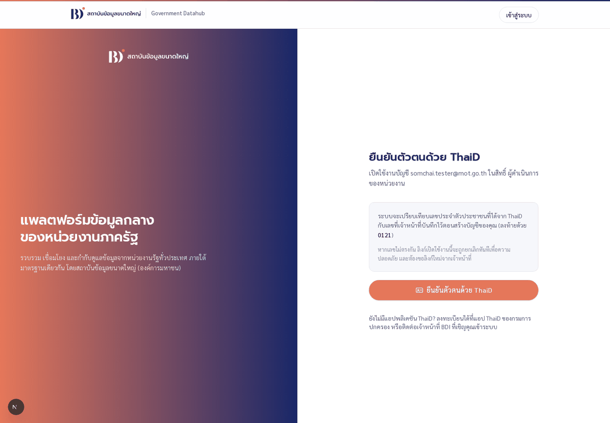
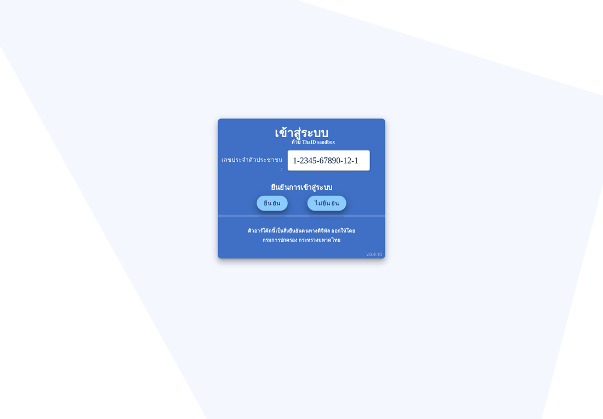
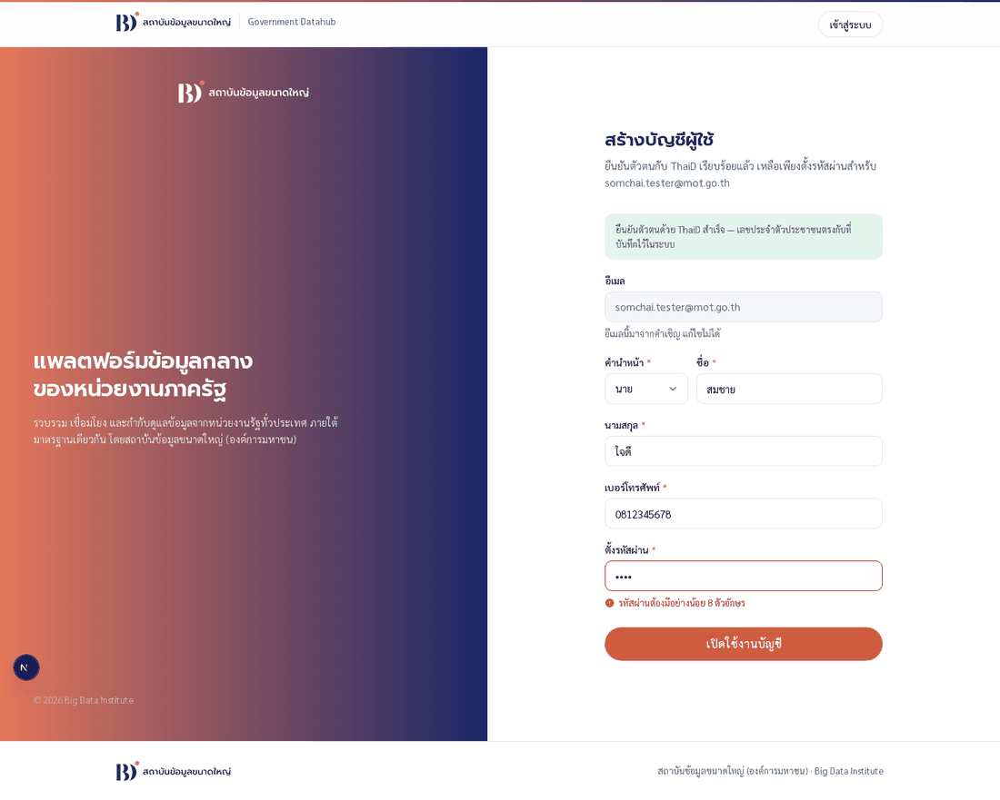
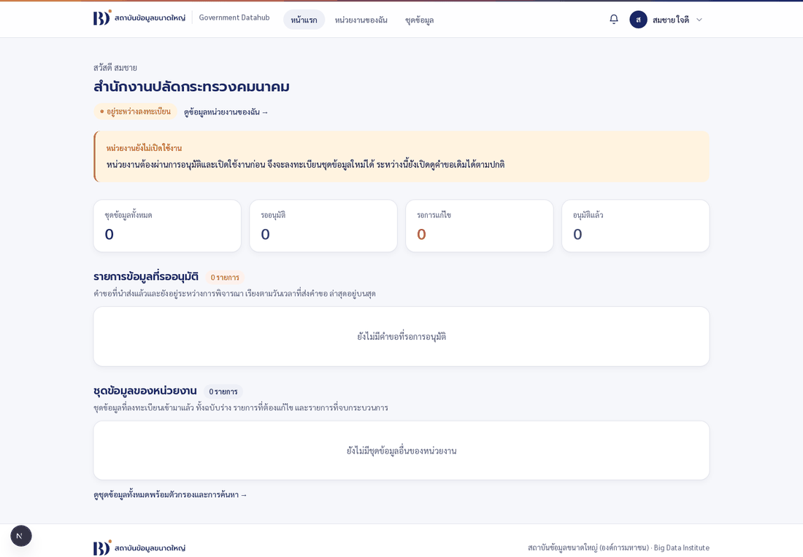

# เล่ม A — ผู้ดูแลระบบสร้างหน่วยงานและส่งคำเชิญ

เล่มนี้แบ่งเป็นสองครึ่ง

- **ข้อ 0–4 สำหรับผู้ดูแลระบบ** ขั้นตอนนี้ **ไม่มีหน้าจอ** เพราะข้อกำหนดระบุไว้แบบนั้น
  จึงต้องสั่งงานผ่าน API ด้วยคำสั่ง `curl` หรือโปรแกรม Postman
- **ข้อ 5–7 สำหรับผู้ถูกเชิญ** เป็นการกดบนหน้าเว็บล้วน ๆ ไม่ต้องพิมพ์คำสั่งอะไรเลย
  ถ้าคุณเป็นผู้ถูกเชิญ ข้ามมาอ่านตรงนั้นได้เลย

> อ่าน [เล่มภาพรวม](12-tester-manual-overview.md) ก่อนเริ่ม

> ⚠️ **ระบบสาธารณะส่งอีเมลจริง** ทุกคำเชิญที่คุณสร้างในเล่มนี้จะถูกส่งออกไปที่อีเมลนั้นจริง ๆ
> ใช้อีเมลของคนที่ตั้งใจจะเชิญเท่านั้น อย่าใช้อีเมลสมมติหรืออีเมลของคนอื่นเพื่อลองเล่น

---

## 0. เตรียมของสองอย่าง

| สิ่งที่ต้องมี | ค่าที่ใช้จริง |
| --- | --- |
| **ที่อยู่ของ API** | `https://bdi-api.thammasorn.org` |
| **รหัสลับของผู้ดูแล** (`ADMIN_API_TOKEN`) | อ่านจาก `main/.env` บนเครื่องที่ติดตั้งระบบ — เป็นความลับจริง ห้ามเขียนลงไฟล์ที่ขึ้น git |

ทุกคำสั่งในเล่มนี้ต้องแนบหัวข้อ `x-admin-token` ไปด้วยเสมอ ถ้าลืมแนบหรือใส่ผิด ระบบจะตอบว่า

```json
{"error":"unauthenticated","message":"x-admin-token ไม่ถูกต้อง"}
```

ตั้งตัวแปรไว้ก่อน จะได้ไม่ต้องพิมพ์ซ้ำทุกครั้ง

```bash
cd /hdd1tb/bdi-project/main            # checkout ที่เปิดสู่สาธารณะ
export API=https://bdi-api.thammasorn.org
export T=$(grep ^ADMIN_API_TOKEN= .env | cut -d= -f2)
```

> **`bdi-api.thammasorn.org` มีไว้สำหรับผู้เรียก API จากภายนอกโดยเฉพาะ** ส่วนเบราว์เซอร์
> ของผู้ใช้เรียก API ที่ `bdi.thammasorn.org/api/...` ซึ่งเป็นโดเมนเดียวกับหน้าเว็บอยู่แล้ว
> ทั้งสองทางวิ่งไปที่ระบบตัวเดียวกัน

> ถ้าถนัด Postman มากกว่า มีคอลเลกชันเตรียมไว้ให้แล้วที่
> `docs/bdi-admin-portal.postman_collection.json` พร้อมไฟล์ environment สามแบบวางไว้ข้าง ๆ กัน
> นำเข้าทั้งคอลเลกชันและ environment แล้วอย่าลืมเลือก environment ที่มุมขวาบนก่อนกดเรียก API

---

## 1. สร้างหน่วยงานไว้ล่วงหน้า

ผู้ดูแลระบบสร้างหน่วยงานไว้ก่อน แล้วค่อยผูกคำเชิญเข้ากับหน่วยงานนั้น ข้อมูลที่กรอกไว้ตรงนี้
จะถูก **เติมลงในแบบฟอร์มของผู้ใช้ให้อัตโนมัติ** ตอนที่เขาเริ่มลงทะเบียนในเล่ม B
ผู้ใช้จึงแทบไม่ต้องพิมพ์ข้อมูลหน่วยงานเองเลย

```bash
curl -s -X POST $API/api/admin/organizations \
  -H "x-admin-token: $T" -H 'Content-Type: application/json' \
  -d '{
    "organizationCode": "MOT-DEMO-01",
    "nameTh": "สำนักงานปลัดกระทรวงคมนาคม",
    "nameEn": "Office of the Permanent Secretary, Ministry of Transport",
    "organizationType": "ส่วนราชการ",
    "addressLine": "38 ถนนราชดำเนินนอก",
    "province": "กรุงเทพมหานคร",
    "district": "ป้อมปราบศัตรูพ่าย",
    "subdistrict": "วัดโสมนัส",
    "postalCode": "10100",
    "phone": "022835000",
    "email": "saraban@mot.go.th",
    "websiteUrl": "https://www.mot.go.th"
  }'
```

สำเร็จแล้วระบบตอบกลับด้วยรหัส `201` พร้อม `organization.id` — **เก็บ id นี้ไว้ ต้องใช้ต่อในข้อ 2**

```json
{"organization":{"id":"8dfc51f7-582f-45bf-bd14-31e7c7bdf676",
  "organizationCode":"MOT-DEMO-01","status":"PENDING_REGISTRATION", … }}
```

### ข้อควรรู้

| เรื่อง | รายละเอียด |
| --- | --- |
| ช่องที่บังคับ | มีแค่ **`organizationCode` กับ `nameTh`** ที่เหลือเว้นว่างได้ทั้งหมด |
| `organizationCode` | ผู้ดูแลกำหนดเอง ระบบไม่สร้างให้ · ห้ามซ้ำกับหน่วยงานอื่น ถ้าซ้ำจะได้ `409 code_exists` |
| สถานะตอนสร้าง | เป็น `PENDING_REGISTRATION` และจะกลายเป็น `ACTIVE` ก็ต่อเมื่อผ่านเล่ม B ครบทุกด่าน |
| ที่อยู่ | ส่งเป็น **ชื่อ** ไม่ใช่รหัส และต้องสะกดตรงกับที่ระบบมี ("ดุสิต" ไม่ใช่ "เขตดุสิต") ถ้าไม่ตรงจะได้ `400` พร้อมบอกว่าช่องไหนผิด |
| รหัสไปรษณีย์ | ถ้าใส่จังหวัด/อำเภอ/ตำบลครบแล้ว ไม่ต้องส่งมา ระบบเติมให้เอง |

### เรียกดูและแก้ไขภายหลัง

```bash
curl -s "$API/api/admin/organizations?q=คมนาคม"     -H "x-admin-token: $T"   # ค้นหา
curl -s "$API/api/admin/organizations?status=ACTIVE" -H "x-admin-token: $T"   # กรองตามสถานะ
curl -s "$API/api/admin/organizations/<id>"          -H "x-admin-token: $T"   # ดูรายละเอียด
```

`GET /api/admin/organizations/<id>` คืนมาให้ในคำตอบเดียวทั้ง **ข้อมูลหน่วยงาน** ·
**คำขอจดทะเบียน** · **คำเชิญ** ของหน่วยงานนั้น ใช้ตรวจได้เลยว่าคำเชิญส่งไปหาใคร
และถูกใช้ไปแล้วหรือยัง

แก้ไขเฉพาะช่องที่ต้องการได้ โดยส่งมาเฉพาะช่องนั้น (ช่องที่ไม่ส่งมา = ไม่แตะ · ส่ง `null` = ล้างค่า)

```bash
curl -s -X PATCH $API/api/admin/organizations/<id> \
  -H "x-admin-token: $T" -H 'Content-Type: application/json' \
  -d '{"phone":"022835050"}'
```

> ⚠️ **ถ้าผู้ใช้เปิดแบบฟอร์มไปแล้ว การแก้ตรงนี้จะไม่ไปถึงแบบฟอร์มของเขา** เพราะระบบคัดลอก
> ข้อมูลไปตั้งแต่วินาทีที่เขาเริ่มกรอก (ถ้าเขียนทับทีหลังจะไปลบสิ่งที่เขาพิมพ์ไว้)
> กรณีนี้ระบบจะแนบ `warning.code = "registration_in_progress"` พร้อมเลขที่คำขอกลับมาเตือน
> ให้แจ้งผู้ใช้ไปแก้ในแบบฟอร์มเอง

---

## 2. ส่งคำเชิญให้ผู้ใช้

```bash
curl -s -X POST $API/api/admin/invitations \
  -H "x-admin-token: $T" -H 'Content-Type: application/json' \
  -d '{
    "email": "somchai.tester@mot.go.th",
    "role": "ORGANIZATION_USER",
    "cid": "1234567890121",
    "organizationId": "8dfc51f7-582f-45bf-bd14-31e7c7bdf676"
  }'
```

สำเร็จแล้วได้ `201`

```json
{"activationKeyId":"c517f24a-…","userAccountId":"06d5c8b2-…",
 "email":"somchai.tester@mot.go.th","role":"ORGANIZATION_USER",
 "roleLabel":"ผู้ดำเนินการของหน่วยงาน","organizationId":"8dfc51f7-…",
 "expiresAt":"2026-08-24T16:32:52.176Z"}
```

### แต่ละช่องคืออะไร

| ช่อง | บังคับ | รายละเอียด |
| --- | --- | --- |
| `email` | ✅ | อีเมลของผู้ถูกเชิญ · ห้ามซ้ำกับบัญชีที่มีอยู่แล้ว |
| `role` | ✅ | เลือกหนึ่งค่าจาก `BDI_OFFICER` · `BDI_FINAL_APPROVER` · `BDI_DATASET_SPECIALIST` · `BDI_LEGAL_OFFICER` · `SYSTEM_ADMINISTRATOR` · `ORGANIZATION_USER` · `ORGANIZATION_APPROVER` |
| `firstnameTh` | ✅ **ทุกบทบาท** | ชื่อจริงตามเอกสารที่หน่วยงานส่งมา · เอกสาร A0–A3 ใช้ชื่อนี้ ไม่ใช่ชื่อที่แสดง |
| `lastnameTh` | ✅ **ทุกบทบาท** | นามสกุลจริง |
| `prefixTh` | ไม่บังคับ | ควรใส่ — ThaID ไม่ส่งคำนำหน้ามาให้ ค่านี้เป็นตัวเดียวที่ไปเติมช่องคำนำหน้าในฟอร์มของผู้ถูกเชิญ |
| `cid` | ✅ **ทุกบทบาท** | เลขบัตรประชาชน 13 หลัก · ต้องผ่านการตรวจหลักสุดท้าย · **เป็นเลขที่ระบบจะเอาไปเทียบกับ ThaID ตอนผู้ใช้เปิดใช้งานบัญชี** |
| `organizationId` | ✅ **สำหรับ role ฝั่งหน่วยงาน** | ผูกกับหน่วยงานที่สร้างไว้ในข้อ 1 · `ORGANIZATION_USER` กับ `ORGANIZATION_APPROVER` **ต้องส่งเสมอ** ไม่ส่งจะได้ `400` · role ฝั่ง BDI ไม่ต้องส่ง ระบบผูกกับหน่วยงาน BDI ให้เอง |

> ระบบ **ตั้งใจไม่คืนตัว token กลับมาใน API** ลิงก์เปิดใช้งานจะอยู่ในอีเมลเท่านั้น
> และลิงก์มีอายุ **7 วัน**
>
> **ไม่มีการเชิญซ้ำ** อีเมลหรือเลขบัตรที่มีบัญชีอยู่แล้วจะได้ `409` เสมอ ไม่เขียนทับของเดิม
> ถ้าจะส่งลิงก์ใหม่ให้คนเดิมโดยไม่แก้ข้อมูล ใช้ข้อ 2.1 · ถ้าเชิญผิดต้องลบก่อน (ข้อ 6)

### ข้อผิดพลาดที่เจอบ่อย และความหมาย

| สถานะ | `error` | แปลว่า |
| --- | --- | --- |
| `400` | `validation` | มีช่องกรอกผิด ดูใน `fields` ว่าช่องไหน เช่น `{"cid":"เลขบัตรประชาชนไม่ถูกต้อง"}` |
| `401` | `unauthenticated` | `x-admin-token` ผิด หรือลืมส่งมา |
| `409` | `exists` | อีเมลนี้มีบัญชีหรือคำเชิญค้างอยู่แล้ว · คำตอบคืน `activationKeyId` ของใบเดิมมาให้ ใช้ส่งลิงก์ซ้ำหรือลบได้เลย |
| `409` | `cid_exists` | **เลขบัตรใบนี้เป็นของบัญชีอื่นไปแล้ว** เพราะหนึ่งเลขบัตรมีได้หนึ่งบัญชี ข้อความจะบอกด้วยว่าเป็นของอีเมลไหน |
| `400` | `validation` (`organizationId`) | ลืมส่ง `organizationId` ให้ role ฝั่งหน่วยงาน — สร้างหน่วยงานในข้อ 1 ก่อน แล้วเอา id มาใส่ |

ตัวอย่างคำตอบของ `cid_exists` ซึ่งบอกวิธีแก้มาให้ครบในข้อความเดียว

```json
{"error":"cid_exists","message":"เลขบัตรประชาชนนี้เป็นของบัญชี somchai.tester@mot.go.th อยู่แล้ว —
 หนึ่งเลขบัตรมีได้หนึ่งบัญชี ถ้าเป็นคนเดียวกันและแค่อยากส่งลิงก์ใหม่ ใช้
 POST /api/admin/invitations/:id/resend ถ้าเชิญผิด ให้ลบคำเชิญใบเดิมด้วย
 DELETE /api/admin/invitations/:id แล้วเชิญใหม่",
 "userAccountId":"...","activationKeyId":"..."}
```

---

## 3. ดู ยกเลิก และลบคำเชิญ

```bash
curl -s $API/api/admin/invitations -H "x-admin-token: $T"                     # ดูรายการทั้งหมด
curl -s -X POST $API/api/admin/invitations/<id>/revoke -H "x-admin-token: $T" # ยกเลิก
curl -s -X DELETE $API/api/admin/invitations/<id> -H "x-admin-token: $T"      # ลบ
```

**`revoke` กับ `DELETE` ให้ผลไม่เหมือนกัน เลือกให้ถูก**

| คำสั่ง | ทำอะไร | ใช้ตอนไหน |
| --- | --- | --- |
| `revoke` | ยกเลิกเฉพาะ *ลิงก์* · **บัญชียังอยู่** และยังจองอีเมลกับเลขบัตรใบนั้นไว้ | ส่งลิงก์ผิดคน แต่ข้อมูลบัญชีถูกต้องแล้ว |
| `DELETE` | ลบลิงก์ **และลบบัญชีทิ้งด้วย** ถ้าบัญชีนั้นเกิดขึ้นเพราะคำเชิญใบนี้เท่านั้น | **กรอกอีเมลหรือเลขบัตรผิด** แล้วอยากเอาค่าเดิมกลับมาใช้ใหม่ |

`DELETE` จะลบบัญชีให้ก็ต่อเมื่อบัญชีนั้น ยังเป็น `PENDING` · ไม่มีคีย์ใบอื่น · ยังไม่มีบทบาท ·
ยังไม่ถูกมอบหมายงานตรวจสอบ · ยังไม่เคยลงนามหรือยอมรับเงื่อนไข ถ้าข้อใดข้อหนึ่งไม่ผ่าน
ระบบจะลบให้แค่คำเชิญ พร้อมบอกด้วยว่าติดเรื่องอะไร ส่วนบัญชีที่เป็น `ACTIVE` แล้ว
**จะตอบ `409` เสมอ** เพราะการลบบัญชีที่ใช้งานอยู่ไม่ใช่การ "ลบคำเชิญ"

ตัวอย่างคำตอบของ `DELETE` ที่ลบบัญชีให้ด้วย

```json
{"ok":true,
 "removed":{"activationKeyId":"3ad5faff-…",
   "userAccount":{"email":"typo.person@mot.go.th","cid":"1101700207994"},
   "organization":{"organizationCode":"ORG-2026-0007"},
   "registrationRequest":{"requestNumber":"ORG-REG-2026-0007"}},
 "message":"ลบคำเชิญและบัญชี typo.person@mot.go.th แล้ว — อีเมลและเลขบัตรประชาชนนี้ใช้เชิญใหม่ได้"}
```

---

## 4. ลิงก์เปิดใช้งานบัญชี

บนระบบสาธารณะ **ลิงก์ถูกส่งไปที่อีเมลของผู้ถูกเชิญโดยตรง** ผู้ถูกเชิญเปิดอีเมลแล้วกดปุ่ม
**เปิดใช้งานบัญชี** ในอีเมลได้เลย ผู้ดูแลระบบไม่ต้องทำอะไรเพิ่ม และ **ดูลิงก์ย้อนหลังไม่ได้**
เพราะระบบไม่เคยเก็บลิงก์ไว้ที่ไหนนอกจากในอีเมลฉบับนั้น

ถ้าผู้ถูกเชิญไม่ได้รับ ให้ตรวจตามลำดับนี้

1. ให้เขาดูโฟลเดอร์ **Spam** และ **Promotions** ก่อน — อีเมลฉบับแรกมักตกไปที่นั่น
2. ตรวจว่าอีเมลที่กรอกไปสะกดถูก ด้วย `GET /api/admin/invitations`
3. ถ้าสะกดผิด ให้ลบคำเชิญนั้นด้วย `DELETE` (ข้อ 3) แล้วเชิญใหม่ด้วยอีเมลที่ถูก
4. ถ้าสะกดถูกแต่ยังไม่มา **เชิญอีเมลเดิมซ้ำได้เลย** ระบบจะออกลิงก์ใบใหม่และยกเลิกใบเก่าให้เอง

---

## 5. ผู้ถูกเชิญยืนยันตัวตนด้วย ThaID

> ตั้งแต่ตรงนี้เป็นต้นไป **ผู้ถูกเชิญทำเองบนหน้าเว็บ** ไม่มีคำสั่งให้พิมพ์แล้ว

> ⚠️ **ขั้นตอนนี้ยังทำบน `bdi.thammasorn.org` ไม่ได้** — ที่อยู่ที่กรมการปกครองลงทะเบียนไว้
> ให้บัญชีผู้ใช้บริการของโครงการยังเป็นที่อยู่ของเครื่องพัฒนา ไม่ใช่โดเมนสาธารณะ
> (ยืนยันแล้วด้วยการยิงจริง: ส่งโดเมนสาธารณะไปได้ `400 invalid_request — redirect url mismatch`)
> พอผู้ถูกเชิญยืนยันกับ ThaID เสร็จ เบราว์เซอร์จะถูกส่งกลับไปที่เครื่องของเขาเอง ซึ่งไม่มีอะไรรออยู่
>
> **ระหว่างนี้ทำได้สองทาง**
> 1. ผู้ดูแลระบบเปิดใช้งานบัญชีให้จากเบราว์เซอร์บนเครื่องที่ติดตั้งระบบ แล้วส่งรหัสผ่านให้ผู้ทดสอบ
> 2. ใช้บัญชีที่เปิดใช้งานไว้แล้วในข้อมูลตัวอย่าง โดยเปลี่ยนอีเมลของบัญชีนั้นเป็นอีเมลจริงของผู้ทดสอบก่อน
>
> เรื่องนี้รอกรมการปกครองลงทะเบียนที่อยู่ของโดเมนจริงให้ ไม่ใช่ข้อผิดพลาดของระบบ
> — ส่วนที่เหลือของหัวข้อนี้อธิบายขั้นตอนไว้ให้ครบ เพื่อใช้ตอนที่ลงทะเบียนเสร็จแล้ว

เปิดลิงก์ที่ได้รับมา จะเจอหน้านี้



หน้าจอบอกไว้ล่วงหน้าว่าระบบจะเอาเลขบัตรที่ได้จาก ThaID ไปเทียบกับเลขที่เจ้าหน้าที่บันทึกไว้
และโชว์ **เลข 4 ตัวท้าย** ให้ดูว่าเป็นบัตรใบไหน จากนั้นกด **ยืนยันตัวตนด้วย ThaID**

ระบบจะพาไปที่หน้าของกรมการปกครอง



| ถ้าใช้ระบบทดสอบของกรมการปกครอง | ถ้าใช้ระบบจริง |
| --- | --- |
| **แก้เลขประจำตัวประชาชนในช่องได้เลย** แล้วกด **ยืนยัน** | สแกน QR ด้วยแอป ThaID บนมือถือ |

**ข้อนี้ควรลองทำผิดดูสักครั้ง** — ลองใส่เลขบัตรที่ไม่ตรงกับที่เจ้าหน้าที่บันทึกไว้
ระบบจะปฏิเสธ **แล้วยกเลิกลิงก์ทิ้งทันที** เปิดลิงก์เดิมซ้ำจะขึ้นว่า "ลิงก์คำเชิญนี้ถูกยกเลิกแล้ว"
ต้องขอลิงก์ใหม่เท่านั้น ระบบตั้งใจให้เป็นแบบนี้เพื่อความปลอดภัย ไม่ใช่ข้อผิดพลาด

> เข้าหน้านี้จากหน้าเข้าสู่ระบบก็ได้เหมือนกัน — กด **กรอก Activation Key**
> แล้ววางคีย์ที่ได้จากอีเมลลงไป

---

## 6. ตั้งรหัสผ่านและเปิดใช้งานบัญชี

ยืนยันตัวตนผ่านแล้ว ระบบจะพากลับมาที่หน้า **สร้างบัญชีผู้ใช้**



1. ช่อง **อีเมล** ถูกล็อกไว้แก้ไม่ได้ เพื่อกันไม่ให้คำเชิญถูกใช้ผิดคน
2. เลือก **คำนำหน้า** แล้วกรอก **ชื่อ** กับ **นามสกุล**
   (ถ้า ThaID ส่งชื่อกลับมาด้วย ระบบจะเติมให้ก่อน ขึ้นอยู่กับสิทธิ์ที่ได้รับจากกรมการปกครอง)
3. กรอก **เบอร์โทรศัพท์** — มือถือ 10 หลักขึ้นต้นด้วย `06` `08` หรือ `09` (เช่น `0812345678`)
   หรือเบอร์ที่ทำงาน 9 หลักขึ้นต้นด้วย `0` ตามด้วยรหัสพื้นที่ (เช่น `021234567`)
4. ตั้ง **รหัสผ่าน** อย่างน้อย 8 ตัว มีทั้งตัวอักษรและตัวเลข
5. กด **เปิดใช้งานบัญชี**

ภาพด้านบนคือตอนที่ใส่รหัสผ่านสั้นเกินไป จะเห็นว่าข้อความสีแดงขึ้นใต้ช่องที่มีปัญหา
ลองกรอกผิดดูก่อนได้ ไม่มีผลเสียอะไร

**พอเสร็จแล้วระบบพาเข้าหน้าแรกให้เลย ไม่ต้องเข้าสู่ระบบใหม่อีกรอบ**



หน้าแรกจะบอกชื่อหน่วยงานที่คุณสังกัด สถานะ **อยู่ระหว่างลงทะเบียน** และมีปุ่ม
**กรอกแบบฟอร์มลงทะเบียนหน่วยงาน** ซึ่งเป็นจุดเริ่มต้นของ [เล่ม B](14-tester-manual-journey-b.md)

> ลิงก์คำเชิญ **ใช้ได้ครั้งเดียว** ถ้าเปิดซ้ำจะขึ้นว่า "ลิงก์คำเชิญนี้ถูกใช้ไปแล้ว"

---

## 7. เข้าสู่ระบบครั้งต่อ ๆ ไป

ดูวิธีได้ที่ [เล่มภาพรวม ข้อ 3](12-tester-manual-overview.md) — เข้าได้ทั้งทางรหัสผ่าน + OTP
และทาง ThaID

---

## 8. รายการทดสอบของเล่ม A

ทดสอบผ่านข้อไหนแล้วติ๊กข้อนั้น — สี่ข้อสุดท้ายต้องทำจากเบราว์เซอร์บนเครื่องที่ติดตั้งระบบ
เพราะเกี่ยวกับ ThaID (ดูข้อ 5)

- [ ] สร้างหน่วยงานด้วยข้อมูลครบ → ได้ `201` และสถานะ `PENDING_REGISTRATION`
- [ ] สร้างหน่วยงานด้วยรหัสหน่วยงานที่ซ้ำ → ได้ `409 code_exists`
- [ ] สร้างหน่วยงานโดยใส่ชื่ออำเภอผิด (เช่น "เขตดุสิต") → ได้ `400` พร้อมบอกช่องที่ผิด
- [ ] ส่งคำเชิญพร้อม `organizationId` → ได้ `201`
- [ ] ส่งคำเชิญด้วยเลขบัตรที่มีคนใช้แล้ว → ได้ `409 cid_exists` พร้อมบอกอีเมลเจ้าของเดิม
- [ ] ส่งคำเชิญด้วยเลขบัตรมั่ว (เช่น `1111111111111`) → ได้ `400 validation`
- [ ] เรียก API โดยไม่ใส่ `x-admin-token` → ได้ `401`
- [ ] `revoke` คำเชิญ แล้วลองเปิดลิงก์เดิม → ใช้ไม่ได้แล้ว
- [ ] `DELETE` คำเชิญของบัญชีที่ยังไม่เปิดใช้งาน → ลบบัญชีให้ด้วย และเชิญอีเมลเดิมซ้ำได้
- [ ] `DELETE` คำเชิญของบัญชีที่เปิดใช้งานไปแล้ว → ได้ `409`
- [ ] เปิดใช้งานบัญชีด้วยเลขบัตรที่ **ตรงกัน** → เข้าระบบได้
- [ ] เปิดใช้งานบัญชีด้วยเลขบัตรที่ **ไม่ตรงกัน** → ถูกปฏิเสธ และลิงก์เดิมใช้ไม่ได้อีก
- [ ] ตั้งรหัสผ่านสั้นกว่า 8 ตัว → มีข้อความสีแดงขึ้นใต้ช่อง
- [ ] เปิดลิงก์คำเชิญซ้ำหลังใช้ไปแล้ว → ขึ้นว่าถูกใช้ไปแล้ว
- [ ] เข้าสู่ระบบด้วยรหัสผ่าน + OTP ได้
- [ ] เข้าสู่ระบบด้วย ThaID ได้

---

**ถัดไป:** [เล่ม B — หน่วยงานลงทะเบียนตัวเอง](14-tester-manual-journey-b.md)
