# เล่ม B — หน่วยงานลงทะเบียนตัวเองจนได้รับอนุมัติ

เล่มนี้เขียนให้ **ผู้ทดสอบทั่วไป** ไม่ต้องมีพื้นฐานทางเทคนิค อ่านแล้วทำตามทีละข้อได้เลย
ภาพทุกภาพถ่ายจากระบบจริงตอนทดสอบเมื่อ 17–18 สิงหาคม 2569

> ก่อนเริ่ม: อ่าน [เล่มภาพรวม](12-tester-manual-overview.md) ให้จบ และต้องมีบัญชีที่เปิดใช้งานแล้ว
> (ถ้ายังไม่มี ดูวิธีเปิดใช้งานได้ที่ [เล่ม A ข้อ 5–6](13-tester-manual-journey-a.md))

---

## ภาพรวมของเล่มนี้

```
  คุณ (ผู้ดำเนินการของหน่วยงาน)
      │  กรอกแบบฟอร์ม 3 ส่วน → ตรวจ PDF → นำส่ง
      ▼
  ┌──────────────────────┐   ต้องปรับปรุง    ┌──────────────────┐
  │ รอเจ้าหน้าที่ BDI ตรวจสอบ │ ───────────────▶ │  รอการแก้ไข        │
  │      (ด่านที่ 1)        │ ◀─────────────── │  (คุณแก้แล้วส่งใหม่)  │
  └──────────┬───────────┘                  └──────────────────┘
             │ เจ้าหน้าที่กด "อนุมัติ"  → ถ้าผู้ลงนามยังไม่มีบัญชี ระบบส่งคำเชิญให้เอง
             ▼
  ┌──────────────────────────┐
  │ รอผู้มีอำนาจของหน่วยงานลงนาม │   (ด่านที่ 2)
  └──────────┬───────────────┘
             │ ผู้ลงนามกด "เห็นชอบ"
             ▼
  ┌──────────────────────┐
  │ รอ BDI อนุมัติขั้นสุดท้าย  │   (ด่านที่ 3)
  └──────────┬───────────┘
             │ ผู้อนุมัติ BDI กด "เห็นชอบและลงนาม"
             ▼
        ✅ หน่วยงาน "เปิดใช้งาน" — ไปต่อเล่ม C ได้
```

เล่มนี้ **ต้องสลับใช้ 4 บัญชี** แนะนำให้เปิดหน้าต่างไม่ระบุตัวตนแยกกันคนละหน้าต่างต่อหนึ่งบทบาท

| ขั้น | ใช้บัญชีของ | ตัวอย่างในคู่มือนี้ |
| --- | --- | --- |
| 1 | ผู้ดำเนินการของหน่วยงาน | `somchai.tester@mot.go.th` |
| 2 | เจ้าหน้าที่ BDI | `officer@bdi.or.th` |
| 3 | ผู้มีอำนาจกระทำการแทน | `director.tester@mot.go.th` |
| 4 | ผู้อนุมัติ BDI | `approver@bdi.or.th` |

---

## ขั้นที่ 1 — ผู้ดำเนินการกรอกและนำส่งแบบฟอร์ม

### 1.1 เข้าสู่ระบบแล้วหาปุ่มเริ่มต้น

เข้าสู่ระบบด้วยบัญชีผู้ดำเนินการ จะเจอหน้าแรกแบบนี้

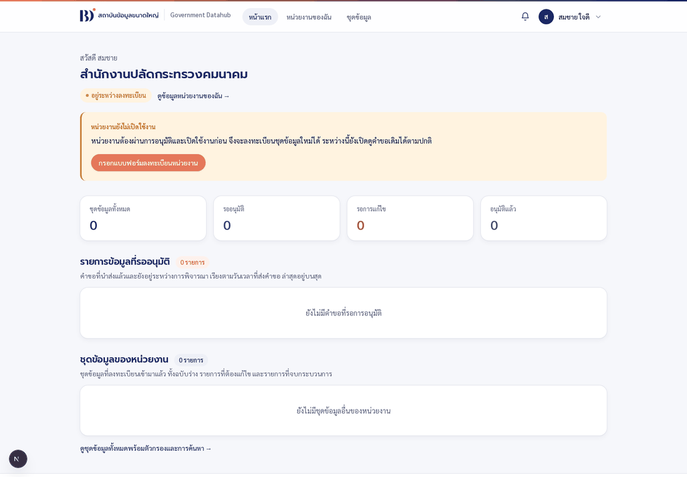

บนหน้านี้มีสามอย่างที่ต้องสังเกต

1. **ชื่อหน่วยงาน** ที่คุณสังกัด พร้อมป้ายสถานะ **อยู่ระหว่างลงทะเบียน**
2. กล่องสีส้ม **หน่วยงานยังไม่เปิดใช้งาน** ซึ่งอธิบายว่าต้องผ่านการอนุมัติก่อน
   จึงจะลงทะเบียนชุดข้อมูลได้
3. ปุ่ม **กรอกแบบฟอร์มลงทะเบียนหน่วยงาน** ← กดปุ่มนี้เพื่อเริ่ม

> กดปุ่มนี้ซ้ำได้ ไม่ต้องกลัวว่าจะเปิดคำขอซ้อนกันหลายใบ ถ้ามีแบบฟอร์มค้างอยู่แล้ว
> ระบบจะพากลับเข้าฉบับเดิมให้เอง

**อีกทางหนึ่ง** จะกดเมนู **หน่วยงานของฉัน** ด้านบนก็ได้ ถ้ายังไม่เคยเริ่มกรอก จะเจอหน้านี้

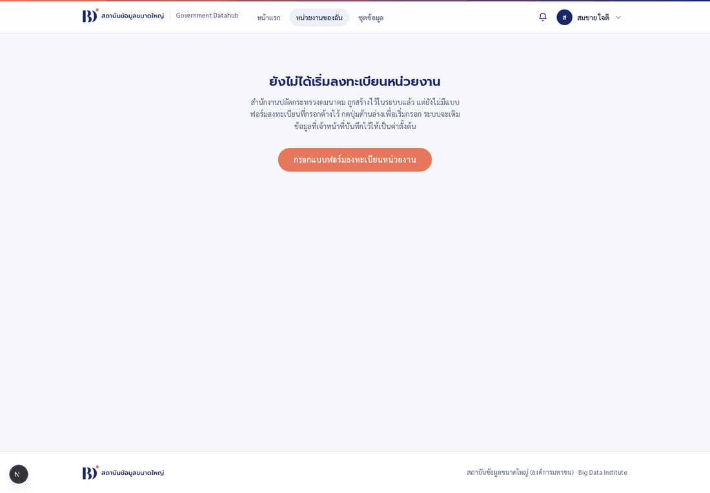

### 1.2 แบบฟอร์มแบ่งเป็นสามส่วน

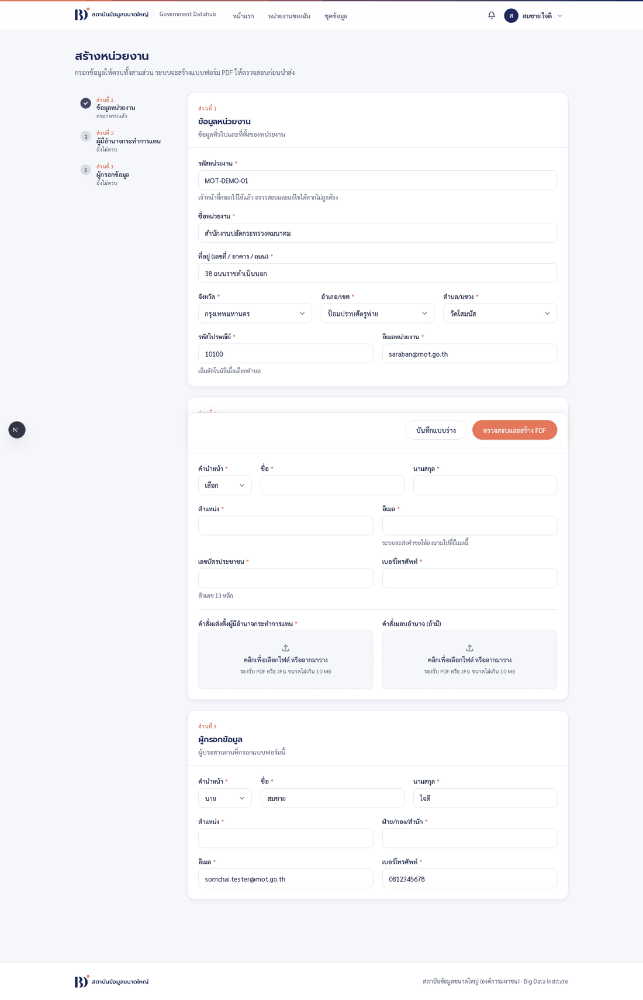

แถบทางซ้ายทำหน้าที่เป็น **สารบัญของทั้งสามส่วน** และคอยบอกว่าส่วนไหนกรอกครบแล้ว
กดที่หัวข้อเพื่อกระโดดไปส่วนนั้นได้เลย

| ส่วน | กรอกอะไรบ้าง | มีอะไรเติมมาให้แล้ว |
| --- | --- | --- |
| **1 — ข้อมูลหน่วยงาน** | ชื่อ · ที่อยู่ · จังหวัด/อำเภอ/ตำบล · รหัสไปรษณีย์ · อีเมลหน่วยงาน | ✅ เจ้าหน้าที่กรอกไว้ให้แล้ว **หน้าที่คุณคือตรวจ และแก้ถ้าไม่ถูก** — ยกเว้น **รหัสหน่วยงาน** ที่เป็นช่องอ่านอย่างเดียว |
| **2 — ผู้มีอำนาจกระทำการแทน** | คำนำหน้า · ชื่อ-สกุล · ตำแหน่ง · อีเมล · เลขบัตรประชาชน · เบอร์โทร · ไฟล์คำสั่งแต่งตั้ง | ต้องกรอกเองทั้งหมด |
| **3 — ผู้กรอกข้อมูล** | คำนำหน้า · ชื่อ-สกุล · ตำแหน่ง · ฝ่าย/กอง/สำนัก · อีเมล · เบอร์โทร | ✅ ชื่อ อีเมล และเบอร์โทร ดึงมาจากบัญชีของคุณ |

**เรื่องที่ต้องระวังในส่วนที่ 1**

- **รหัสหน่วยงานแก้ไม่ได้** ช่องนี้เป็นสีเทาและพิมพ์ทับไม่ได้ ระบบเป็นคนกำหนดให้
  ถ้าเห็นว่าไม่ถูกต้อง อย่าพยายามแก้ที่นี่ — แจ้งเจ้าหน้าที่ BDI ให้แก้ให้
- **ชื่อหน่วยงานต้องมีภาษาไทย** มีภาษาอังกฤษปนได้ (เช่น `สำนักงานสถิติแห่งชาติ (NSO)`)
  แต่พิมพ์เป็นภาษาอังกฤษล้วนไม่ได้ เพราะเอกสารข้อตกลงที่ระบบสร้างให้เป็นเอกสารภาษาไทย
- **อีเมลหน่วยงานต้องไม่ซ้ำกับอีเมลผู้มีอำนาจกระทำการแทนในส่วนที่ 2** ช่องหนึ่งเป็น
  ช่องทางติดต่อกลางของหน่วยงาน อีกช่องคือที่อยู่ที่ระบบส่งคำเชิญให้เข้ามาลงนาม
- **ช่องจะเปลี่ยนสีให้เห็นทันทีที่กรอก** ผิดรูปแบบเป็นขอบแดงพร้อมคำอธิบายว่าต้องแก้อะไร
  ถูกแล้วเป็นขอบเขียวพร้อมเครื่องหมายถูก ไม่ต้องรอกดปุ่มก่อนถึงจะรู้
- **จังหวัด → อำเภอ → ตำบล ผูกกันเป็นทอด ๆ** ต้องเลือกไล่ตามลำดับ
  ถ้าเปลี่ยนจังหวัด อำเภอกับตำบลที่เลือกไว้จะถูกล้างทิ้ง เพราะระบบกันไม่ให้ได้ที่อยู่ที่ไม่มีจริง
- **รหัสไปรษณีย์เติมให้อัตโนมัติ** ทันทีที่เลือกตำบลเสร็จ

**เรื่องที่ต้องระวังในส่วนที่ 2 — สำคัญที่สุดของทั้งเล่ม**

> ⚠️ **อีเมลของผู้มีอำนาจกระทำการแทนคืออีเมลที่ระบบจะส่งเรื่องไปให้ลงนามในขั้นที่ 3**
> และถ้าอีเมลนั้นยังไม่มีบัญชีในระบบ ระบบจะ **ออกคำเชิญให้อัตโนมัติ**
> ดังนั้นต้องใส่อีเมลที่คุณเปิดอ่านได้จริง (หรืออีเมลที่ขอรหัสจากผู้ดูแลระบบได้)

- **เลขบัตรประชาชน 13 หลัก** ระบบตรวจหลักสุดท้ายจริง กรอกมั่วไม่ผ่าน
  เลขที่ใช้ทดสอบได้คือ `1101700207994`
- **คำสั่งแต่งตั้งผู้มีอำนาจกระทำการแทนเป็นไฟล์บังคับ** รับ PDF หรือ JPG ไม่เกิน 10 MB
  จะกดที่กรอบเพื่อเลือกไฟล์ หรือ **ลากไฟล์มาวาง** ก็ได้
  · **ไฟล์จะถูกอัปโหลดทันทีที่เลือก** ไม่ต้องกดบันทึกก่อน
- คำสั่งมอบอำนาจ แนบเพิ่มได้ถ้ามี ไม่บังคับ

### 1.3 บันทึกแบบร่างระหว่างทาง

กด **บันทึกแบบร่าง** ที่แถบล่างของหน้าจอเมื่อไรก็ได้ ไม่บังคับว่าต้องกรอกครบก่อน

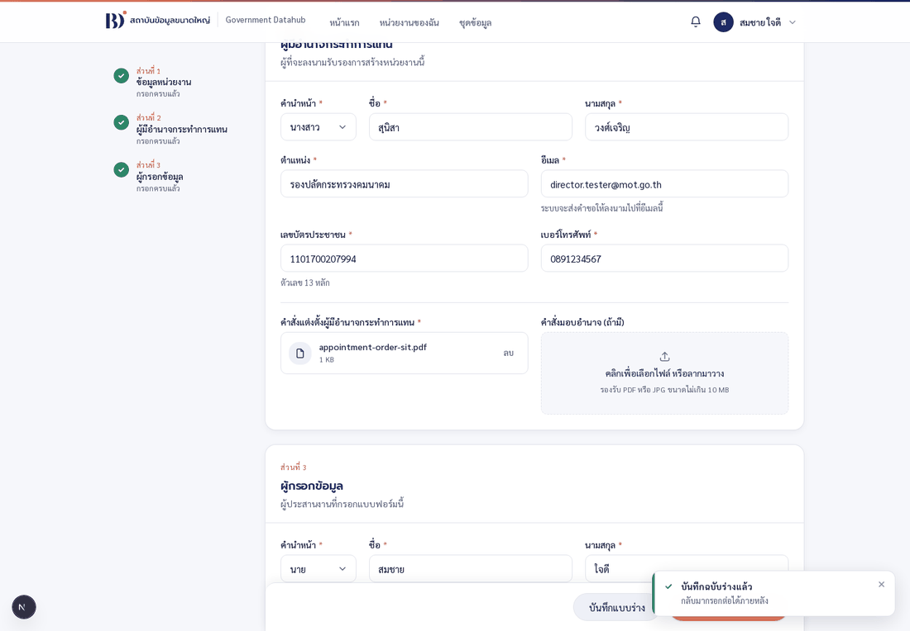

**ลองทดสอบดู:** ปิดเบราว์เซอร์แล้วเปิดกลับเข้ามาใหม่ ข้อมูลต้องอยู่ครบเหมือนเดิม

### 1.4 ให้ระบบตรวจความครบถ้วน

กด **ตรวจสอบและสร้าง PDF** ถ้ายังกรอกไม่ครบ ระบบจะไม่ให้ไปต่อ และขึ้นข้อความสีแดง
ใต้ทุกช่องที่มีปัญหา พร้อมบอกด้วยว่าต้องแก้อย่างไร

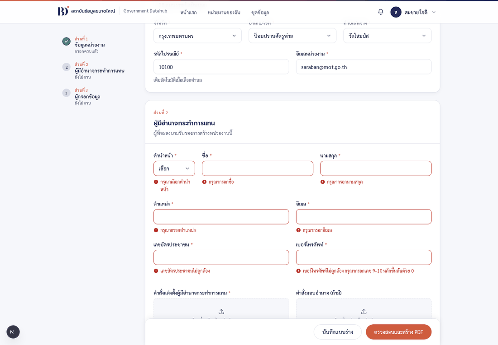

**แนะนำให้ลองกดตอนที่ยังกรอกไม่ครบสักครั้ง** เป็นวิธีที่เร็วที่สุดที่จะรู้ว่าช่องไหนบังคับบ้าง

พอกรอกครบแล้ว ทั้งสามส่วนในแถบซ้ายจะเปลี่ยนเป็นเครื่องหมายถูกสีเขียว **กรอกครบแล้ว**

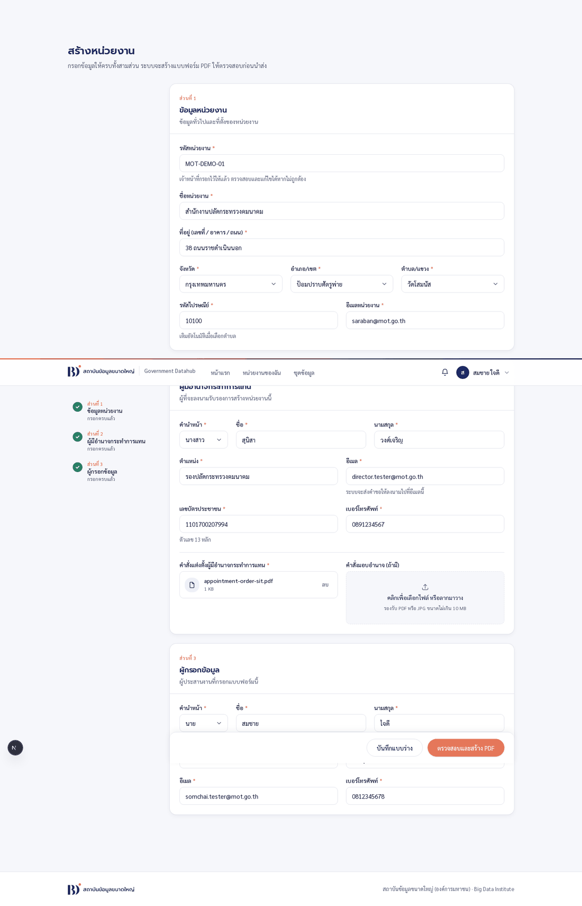

### 1.5 ตรวจแบบฟอร์ม PDF ก่อนนำส่ง

กด **ตรวจสอบและสร้าง PDF** อีกครั้ง คราวนี้ระบบจะสร้างเอกสารแล้วพาไปหน้าตรวจสอบ

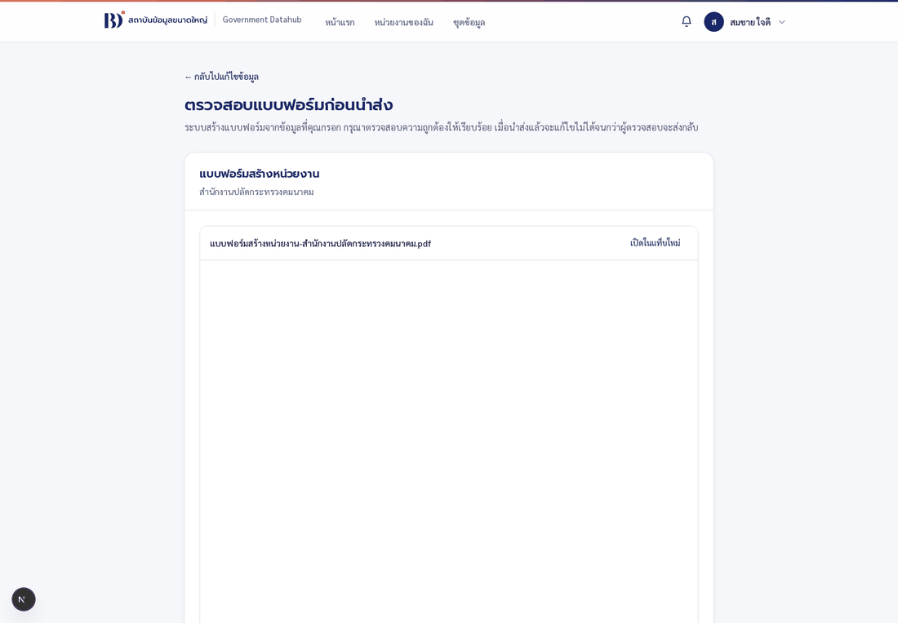

เอกสารที่ระบบสร้างจะออกมาหน้าตาแบบนี้ กด **เปิดในแท็บใหม่** ถ้าอยากดูเต็มหน้าหรือดาวน์โหลดเก็บไว้

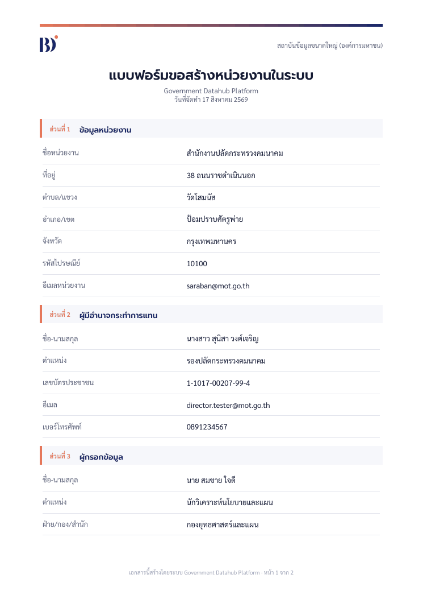

ไล่ตรวจให้ครบทุกบรรทัด ถ้ามีอะไรผิดให้กด **← กลับไปแก้ไขข้อมูล**
ถ้าถูกต้องหมดแล้วกด **นำส่งฟอร์มสร้างหน่วยงาน**

### 1.6 นำส่งเรียบร้อย

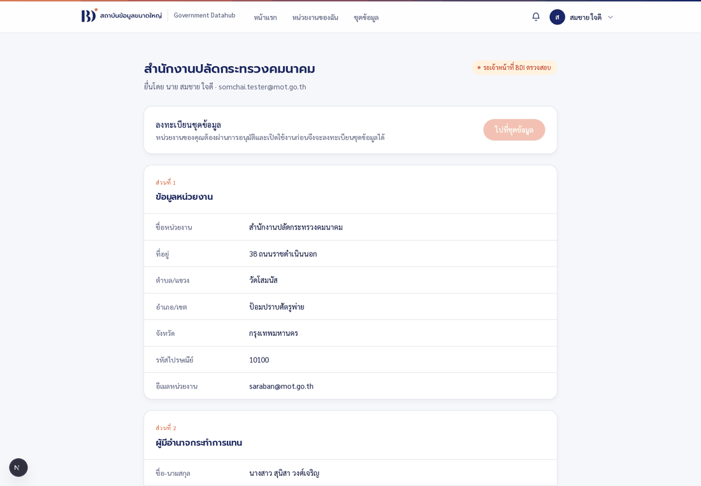

**หลังกดนำส่งจะเกิดสี่อย่างนี้**

- สถานะเปลี่ยนเป็น **รอเจ้าหน้าที่ BDI ตรวจสอบ**
- **แก้ไขไม่ได้อีก** จนกว่าเจ้าหน้าที่จะส่งกลับมาให้แก้
- ระบบส่งอีเมลแจ้งเจ้าหน้าที่ BDI **ทุกคน**
- การ์ด **ลงทะเบียนชุดข้อมูล** โผล่ขึ้นมา แต่ปุ่มยังกดไม่ได้ พร้อมข้อความบอกว่ายังติดอะไรอยู่

---

## ขั้นที่ 2 — เจ้าหน้าที่ BDI ตรวจสอบ

**สลับไปใช้บัญชีเจ้าหน้าที่ BDI** (`officer@bdi.or.th`)
พอเข้าสู่ระบบ ระบบจะพามาที่หน้ารายการหน่วยงานให้เลย

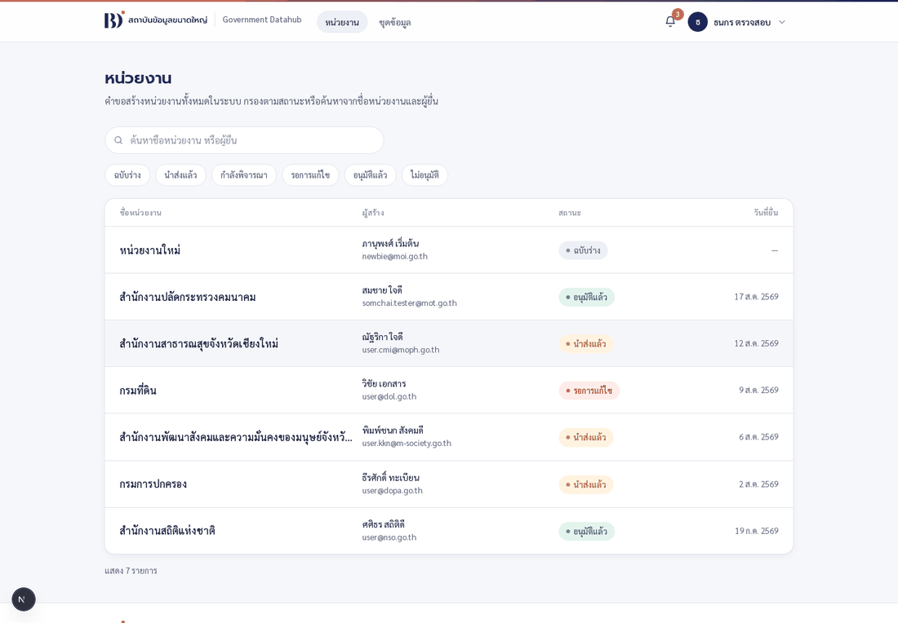

- ตารางแสดง **ชื่อหน่วยงาน · ผู้สร้างพร้อมอีเมล · สถานะ · วันที่ยื่น**
- **กรองได้ด้วยปุ่มสถานะ** ที่อยู่เหนือตาราง (ฉบับร่าง / นำส่งแล้ว / กำลังพิจารณา /
  รอการแก้ไข / อนุมัติแล้ว / ไม่อนุมัติ)
- **ค้นหา** จากชื่อหน่วยงานหรือชื่อผู้ยื่นก็ได้
- คลิกที่แถวไหนก็ได้เพื่อเปิดดูรายละเอียด

เปิดคำขอที่สถานะ **นำส่งแล้ว** ขึ้นมา จะเห็นการ์ดสีส้ม **รอการพิจารณาของคุณ** อยู่บนสุด

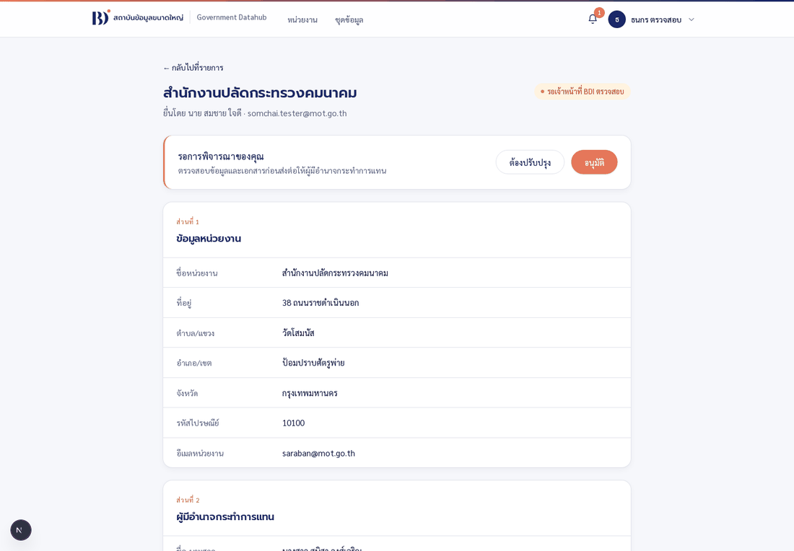

เลื่อนลงไปดูได้ครบทั้ง **ข้อมูลทั้งสามส่วน · ไฟล์แนบ · แบบฟอร์ม PDF ที่ระบบสร้าง ·
ประวัติการดำเนินการ** ตรวจเสร็จแล้วเลือกทางใดทางหนึ่ง

### ทางที่ 1 — ส่งกลับให้แก้ไข

กด **ต้องปรับปรุง** จะมีกล่องข้อความเด้งขึ้นมา

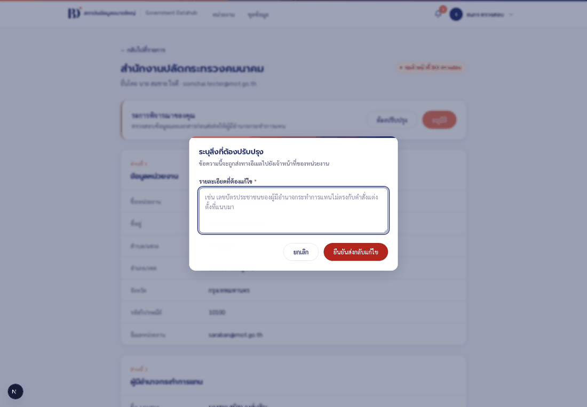

พิมพ์สิ่งที่ต้องแก้ **อย่างน้อย 10 ตัวอักษร** (ถ้าพิมพ์สั้นกว่านั้นระบบจะเตือนและไม่ให้กดผ่าน)
แล้วกด **ยืนยันส่งกลับแก้ไข**

ข้อความที่พิมพ์จะถูกส่งไปถึงผู้กรอกทั้งทางอีเมลและการแจ้งเตือนในระบบ
**เขียนให้ชัดว่าต้องแก้อะไร** เพราะนี่คือสิ่งเดียวที่เขาจะได้อ่าน

### ทางที่ 2 — อนุมัติ

กด **อนุมัติ** แล้วยืนยันในกล่องที่ขึ้นมา

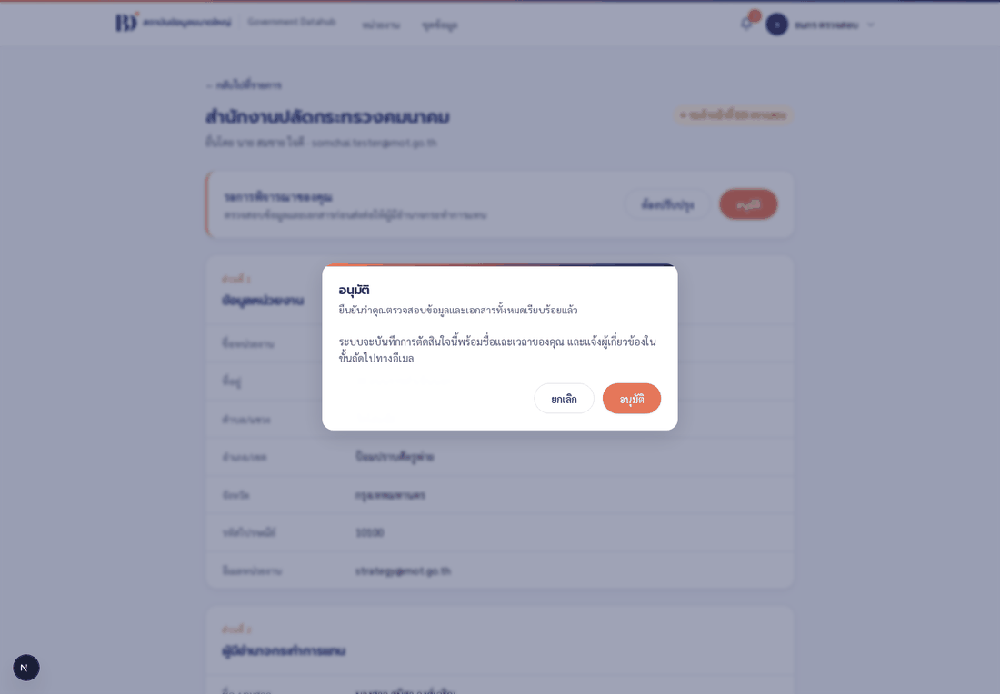

**หลังกดอนุมัติจะเกิดอะไรขึ้น**

- สถานะเปลี่ยนเป็น **รอผู้มีอำนาจของหน่วยงานลงนาม**
- ถ้าอีเมลผู้มีอำนาจ **ยังไม่มีบัญชี** ระบบจะสร้างคำเชิญและส่งลิงก์เปิดใช้งานบัญชีไปให้เอง
- ถ้ามีบัญชีอยู่แล้ว ระบบจะเพิ่มสิทธิ์ผู้ลงนามให้ทันที
- ระบบส่งอีเมลขอความเห็นชอบไปที่อีเมลนั้น

---

## ขั้นที่ 2.5 — ผู้กรอกแก้ไขแล้วนำส่งใหม่ (เฉพาะกรณีถูกส่งกลับ)

**กลับไปใช้บัญชีผู้ดำเนินการ** จะเห็นตัวเลขบนกระดิ่งแจ้งเตือนเพิ่มขึ้นมา
กดกระดิ่ง แล้วกดที่หัวข้อ **คำขอถูกส่งกลับให้แก้ไข** เพื่อกระโดดไปที่คำขอนั้นได้เลย


หน้ารายละเอียดจะมี **กล่องสีแดง** บอกครบว่าต้องแก้อะไร ใครเป็นคนสั่งแก้ และสั่งเมื่อไร

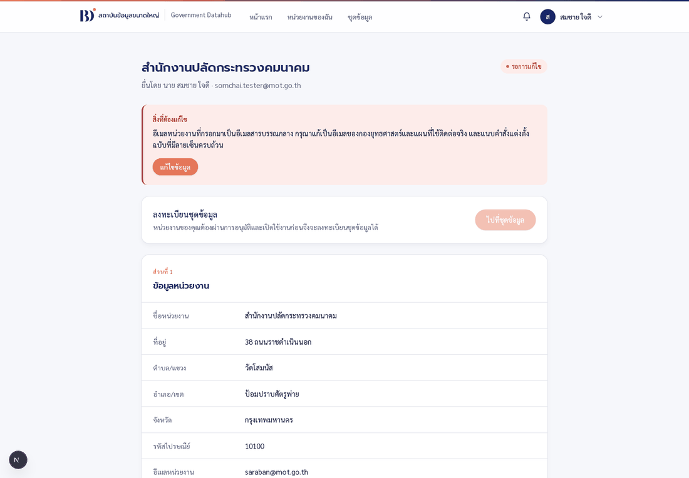

กด **แก้ไขข้อมูล** ระบบจะพากลับเข้าแบบฟอร์ม และแสดงข้อความของผู้ตรวจสอบค้างไว้ด้านบน
ตลอดเวลาที่คุณแก้ จะได้ไม่ต้องจำเอง

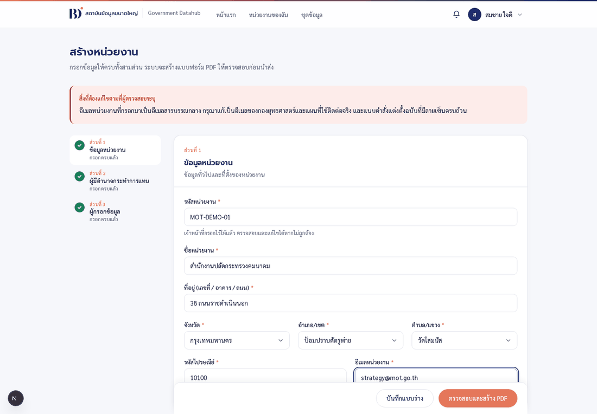

แก้เสร็จแล้วทำเหมือนรอบแรก คือ **ตรวจสอบและสร้าง PDF → นำส่ง**
สถานะจะกลับไปที่ **รอเจ้าหน้าที่ BDI ตรวจสอบ** เสมอ เพราะผู้ตรวจทุกด่านต้องได้เห็นฉบับที่แก้แล้ว

---

## ขั้นที่ 3 — ผู้มีอำนาจกระทำการแทนเห็นชอบ

**สลับไปใช้บัญชีผู้มีอำนาจกระทำการแทน** ซึ่งก็คืออีเมลที่กรอกไว้ในส่วนที่ 2 ของแบบฟอร์ม

ถ้าเป็นบัญชีใหม่ ต้องเปิดใช้งานบัญชีก่อนด้วยลิงก์ที่ได้รับ ขั้นตอนเหมือนกับ
[เล่ม A ข้อ 5–6](13-tester-manual-journey-a.md) ทุกอย่าง

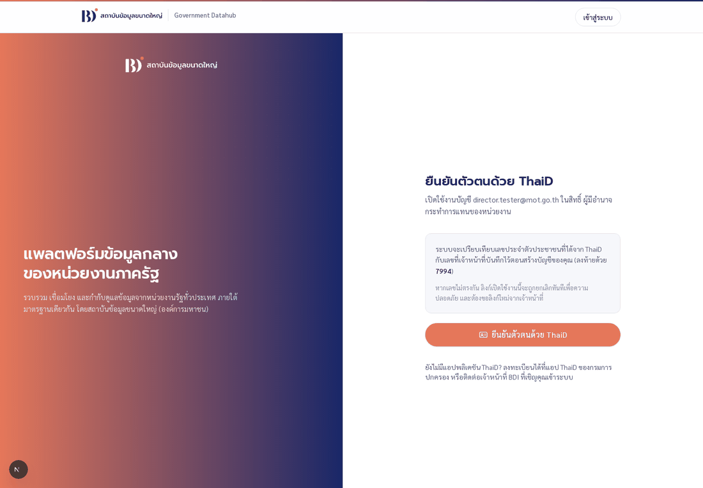

> ⚠️ ตรงนี้ต้องใส่ **เลขบัตรประชาชนของผู้ลงนาม** ตามที่กรอกไว้ในส่วนที่ 2 ของแบบฟอร์ม
> ไม่ใช่เลขของผู้กรอก ถ้าใส่ผิดลิงก์จะถูกยกเลิกทันที
>
> **บน `bdi.thammasorn.org` ขั้นเปิดใช้งานบัญชีด้วย ThaiD ยังทำไม่ได้**
> (ดูเหตุผลใน [เล่ม A ข้อ 5](13-tester-manual-journey-a.md)) ให้ผู้ดูแลระบบเตรียมบัญชี
> ผู้ลงนามที่เปิดใช้งานแล้วไว้ให้ก่อนเริ่มเล่มนี้ แล้วข้ามมาที่ย่อหน้าถัดไปได้เลย

เข้าระบบได้แล้วกดเมนู **หน่วยงานของฉัน** จะเห็นการ์ด **รอการพิจารณาของคุณ**

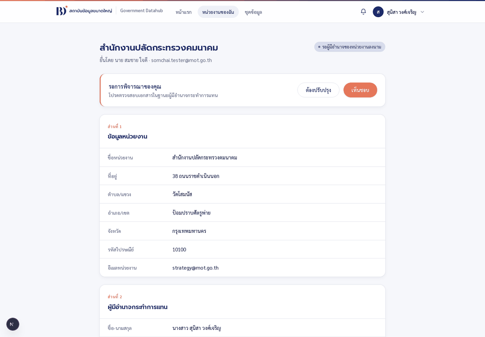

ตรวจแบบฟอร์ม PDF ให้เรียบร้อย แล้วเลือกอย่างใดอย่างหนึ่ง

| ปุ่ม | ผลที่ตามมา |
| --- | --- |
| **เห็นชอบ** | สถานะไปเป็น **รอ BDI อนุมัติขั้นสุดท้าย** และระบบแจ้งผู้อนุมัติ BDI |
| **ต้องปรับปรุง** | ส่งกลับให้ผู้กรอกแก้ (ต้องพิมพ์เหตุผลอย่างน้อย 10 ตัวอักษร) |

---

## ขั้นที่ 4 — ผู้อนุมัติ BDI ลงนาม

**สลับไปใช้บัญชีผู้อนุมัติ BDI** (`approver@bdi.or.th`)

เมนูของบัญชีนี้จะมี **คำขอที่ต้องพิจารณา** เพิ่มขึ้นมาอีกหนึ่งรายการ
เปิดคำขอที่สถานะ **รอ BDI อนุมัติขั้นสุดท้าย**

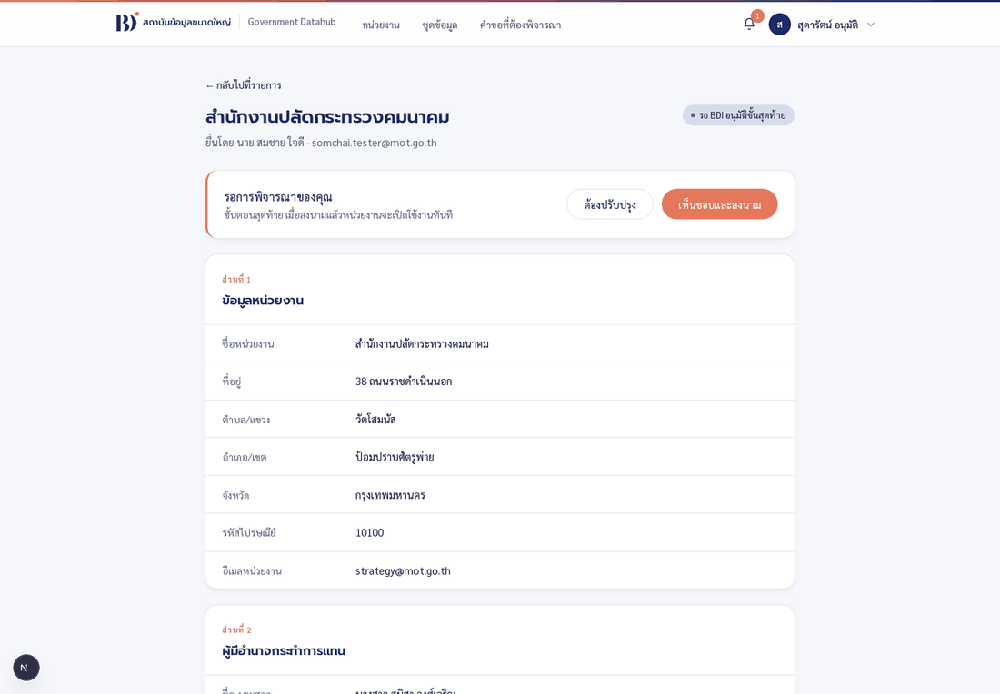

กด **เห็นชอบและลงนาม** แล้วยืนยัน

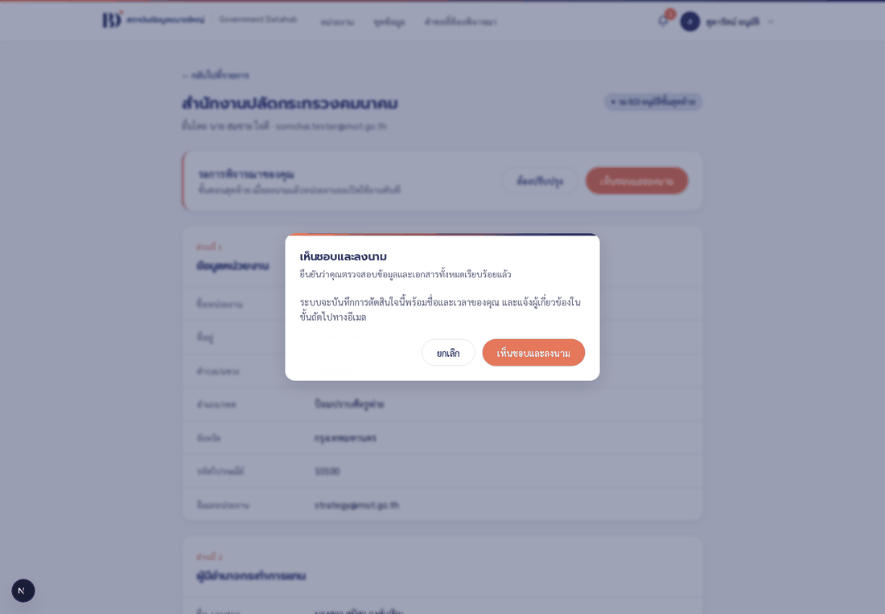

**หน่วยงานเปิดใช้งานเรียบร้อย** 🎉

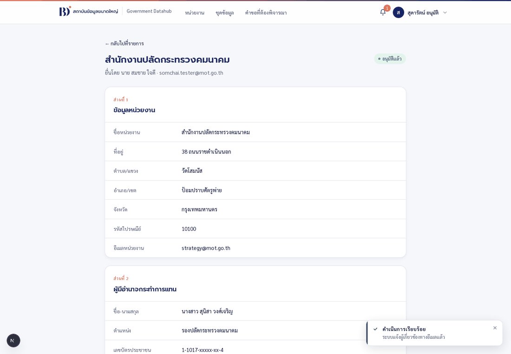

ระบบจะแจ้งทั้งผู้กรอกและผู้มีอำนาจว่าหน่วยงานพร้อมใช้งานแล้ว
พร้อมกับปลดล็อกให้เริ่มลงทะเบียนชุดข้อมูลได้

---

## ดูผลย้อนหลัง

เลื่อนลงล่างสุดของหน้ารายละเอียด จะเจอ **ประวัติการดำเนินการ** ที่เรียงครบทุกด่าน
บอกว่าใครทำอะไรเมื่อไร พร้อมข้อความที่พิมพ์ตอนส่งกลับให้แก้

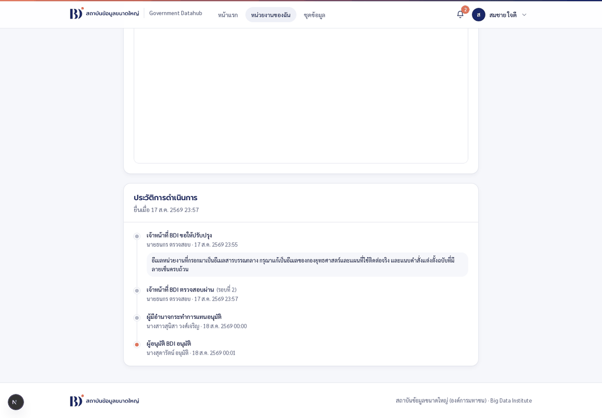

จากภาพนี้อ่านได้ว่า เจ้าหน้าที่ขอให้ปรับปรุงหนึ่งครั้ง (พร้อมเหตุผล) → ตรวจผ่านในรอบที่ 2 →
ผู้มีอำนาจอนุมัติ → ผู้อนุมัติ BDI อนุมัติ

---

## รายการทดสอบของเล่ม B

- [ ] หน้าแรกของผู้ดำเนินการมีปุ่มพาเข้าแบบฟอร์ม และเมนู **หน่วยงานของฉัน** กดแล้วเปิดได้
- [ ] ส่วนที่ 1 ถูกเติมข้อมูลที่เจ้าหน้าที่เตรียมไว้ และส่วนที่ 3 ถูกเติมจากบัญชีของคุณ
- [ ] เปลี่ยนจังหวัดแล้วอำเภอกับตำบลถูกล้าง
- [ ] เลือกตำบลแล้วรหัสไปรษณีย์เติมให้เอง
- [ ] กด **ตรวจสอบและสร้าง PDF** ตอนยังกรอกไม่ครบ → มีข้อความสีแดงใต้ช่องที่ผิด
      **และต้องเป็นภาษาไทยทุกช่อง**
- [ ] ใส่เลขบัตรประชาชนมั่ว → ไม่ผ่าน
- [ ] ใส่เบอร์โทรผิดรูปแบบ (`0112345678` ขึ้นต้น 01 · `081234567` มือถือแค่ 9 หลัก ·
      `0888888888` เลขซ้ำทั้งเบอร์) → ไม่ผ่านทั้งสามแบบ
- [ ] ช่องเปลี่ยนสีทันทีระหว่างพิมพ์ ไม่ต้องรอกดปุ่ม — ผิดเป็นแดงพร้อมคำอธิบาย
      ถูกเป็นเขียวพร้อมเครื่องหมายถูก
- [ ] พิมพ์ชื่อหน่วยงานเป็นภาษาอังกฤษล้วน → ไม่ผ่าน · ปนไทยกับอังกฤษ → ผ่าน
- [ ] กรอกอีเมลหน่วยงานให้ซ้ำกับอีเมลผู้มีอำนาจกระทำการแทน → ไม่ผ่าน
- [ ] **รหัสหน่วยงานพิมพ์ทับไม่ได้** ช่องเป็นสีเทาและคำใบ้บอกให้แจ้งเจ้าหน้าที่ BDI
- [ ] ที่อยู่ยาว ๆ (ชื่ออาคาร ชั้น ห้อง ซอย ครบ เกิน 300 ตัวอักษร) บันทึกได้ ไม่ถูกตัด
- [ ] แนบไฟล์คำสั่งแต่งตั้งได้ทั้งแบบเลือกไฟล์และแบบลากมาวาง
- [ ] กด **บันทึกแบบร่าง** แล้วปิดเบราว์เซอร์ กลับมาข้อมูลยังอยู่
- [ ] PDF ที่ระบบสร้างแสดงภาษาไทยถูกต้องครบทุกส่วน
- [ ] นำส่งแล้วแก้ไขไม่ได้ **และหน้าแรกไม่มีปุ่ม "กรอกแบบฟอร์มลงทะเบียนหน่วยงาน" อีก**
      (ปุ่มกลับมาเมื่อเจ้าหน้าที่ส่งคำขอกลับมาให้แก้)
- [ ] เจ้าหน้าที่ BDI เห็นคำขอในตาราง กรองและค้นหาได้
- [ ] เจ้าหน้าที่กด **ต้องปรับปรุง** โดยพิมพ์น้อยกว่า 10 ตัวอักษร → ระบบไม่ยอมให้ผ่าน
- [ ] ผู้กรอกได้รับการแจ้งเตือน และกดที่การแจ้งเตือนแล้วไปถึงคำขอนั้นจริง
- [ ] กล่องสีแดงบอกครบทั้ง **สิ่งที่ต้องแก้ · โดยใคร · เมื่อไหร่**
- [ ] แก้แล้วนำส่งใหม่ → กลับไปเริ่มที่ด่านที่ 1
- [ ] เจ้าหน้าที่กด **อนุมัติ** → ผู้ลงนามได้รับคำเชิญ (ในกรณีที่ยังไม่มีบัญชี)
- [ ] ผู้ลงนามเปิดใช้งานบัญชีด้วยเลขบัตรของตัวเองได้
- [ ] ผู้ลงนามกด **เห็นชอบ** → สถานะไปด่านที่ 3
- [ ] ผู้อนุมัติ BDI กด **เห็นชอบและลงนาม** → หน่วยงานขึ้นสถานะ **เปิดใช้งาน**
- [ ] ประวัติการดำเนินการแสดงครบทุกด่าน พร้อมชื่อผู้ทำและเวลา

---

**ถัดไป:** [เล่ม C — ลงทะเบียนชุดข้อมูล](15-tester-manual-journey-c.md)
