# เล่ม C — ลงทะเบียนชุดข้อมูลจนได้รับอนุมัติ

เล่มนี้เขียนให้ **ผู้ทดสอบทั่วไป** ไม่ต้องมีพื้นฐานทางเทคนิค
ภาพทุกภาพถ่ายจากระบบจริงตอนทดสอบเมื่อ 17–18 สิงหาคม 2569

> ก่อนเริ่ม: อ่าน [เล่มภาพรวม](12-tester-manual-overview.md) ให้จบ
> และหน่วยงานของคุณต้องผ่าน [เล่ม B](14-tester-manual-journey-b.md) จนขึ้นสถานะ **เปิดใช้งาน** แล้ว

---

## ภาพรวมของเล่มนี้

```
  คุณ (ผู้ดำเนินการของหน่วยงาน)
      │  กรอกแบบฟอร์ม 5 ส่วน → ตรวจ PDF → นำส่ง
      ▼
  ┌──────────────────────────┐                 ┌──────────────────┐
  │ รอเจ้าหน้าที่ BDI ตรวจสอบ     │ ──ต้องปรับปรุง──▶ │  รอการแก้ไข        │
  │      (ด่านที่ 1)            │ ◀───แก้แล้วส่งใหม่── │                  │
  └────┬─────────────────┬───┘                 └──────────────────┘
       │ มอบหมาย          │ ส่งต่อ
       ▼ (ไม่บังคับ)       │
  ┌──────────────────────┐│
  │ รอผู้เชี่ยวชาญพิจารณา    ││  บันทึกความเห็น → คืนให้เจ้าหน้าที่
  └──────────┬───────────┘│
             └────────────┤
                          ▼
              ┌──────────────────────────┐
              │ รอผู้มีอำนาจของหน่วยงานลงนาม │  (ด่านที่ 2)
              └──────────┬───────────────┘
                         ▼
              ┌──────────────────────┐    ไม่อนุมัติ    ┌──────────┐
              │ รอ BDI อนุมัติขั้นสุดท้าย  │ ────────────▶ │ ไม่อนุมัติ │ ปิดถาวร
              │      (ด่านที่ 3)        │                └──────────┘
              └──────────┬───────────┘
                         │ อนุมัติ
                         ▼
                   ✅ อนุมัติแล้ว + ได้เอกสารฉบับอนุมัติ
```

เล่มนี้ **ต้องสลับใช้ 5 บัญชี**

| ขั้น | ใช้บัญชีของ | ตัวอย่างในคู่มือนี้ |
| --- | --- | --- |
| 1 | ผู้ดำเนินการของหน่วยงาน | `somchai.tester@mot.go.th` |
| 2 | เจ้าหน้าที่ BDI | `officer@bdi.or.th` |
| 2.5 | ผู้เชี่ยวชาญข้อมูล BDI (ไม่บังคับ) | `specialist@bdi.or.th` |
| 3 | ผู้มีอำนาจกระทำการแทน | `director.tester@mot.go.th` |
| 4 | ผู้อนุมัติ BDI | `approver@bdi.or.th` |

> **เปลี่ยนแปลง 2026-08-30** — เดิมเจ้าหน้าที่ BDI ต้องกลับมา "ตรวจซ้ำ" อีกรอบหลังผู้มีอำนาจ
> ลงนาม ขั้นนั้นถูกยกเลิกแล้ว ลงนามเสร็จคำขอไปที่ผู้อนุมัติ BDI ทันที ถ้าคู่มือฉบับพิมพ์ที่คุณถือ
> อยู่ยังมีขั้นนั้น ให้ใช้ฉบับนี้แทน

---

## 1. เงื่อนไขก่อนเริ่ม

ปุ่ม **ลงทะเบียนชุดข้อมูล** จะกดได้ก็ต่อเมื่อครบทั้งสามข้อนี้

1. คุณเป็น **ผู้ดำเนินการของหน่วยงาน**
2. หน่วยงานของคุณอยู่ในสถานะ **เปิดใช้งาน** แล้ว (ผ่านเล่ม B ครบทุกด่าน)
3. หน่วยงานมีทั้ง **ผู้ดำเนินการ** และ **ผู้มีอำนาจกระทำการแทน** ที่เปิดใช้งานบัญชีเรียบร้อย

ถ้ายังไม่ครบ ระบบ **จะไม่ซ่อนปุ่ม แต่จะทำให้กดไม่ได้** พร้อมข้อความบอกว่าติดข้อไหนอยู่
เพราะข้อกำหนดระบุว่าผู้ใช้ต้องรู้เสมอว่าต้องทำอะไรต่อ

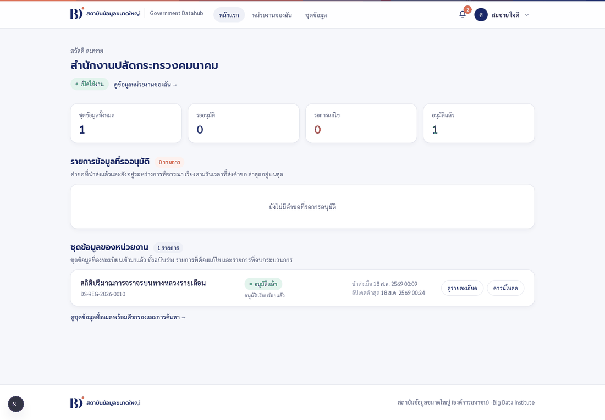

*หน้าแรกเมื่อหน่วยงานเปิดใช้งานแล้ว — กล่องสีส้มที่เคยเตือนหายไป และมีการ์ดสรุปนับจำนวนคำขอมาแทน*

---

## 2. ขั้นที่ 1 — กรอกและนำส่งคำขอ

### 2.1 เปิดหน้าชุดข้อมูล

กดเมนู **ชุดข้อมูล** ที่แถบด้านบน

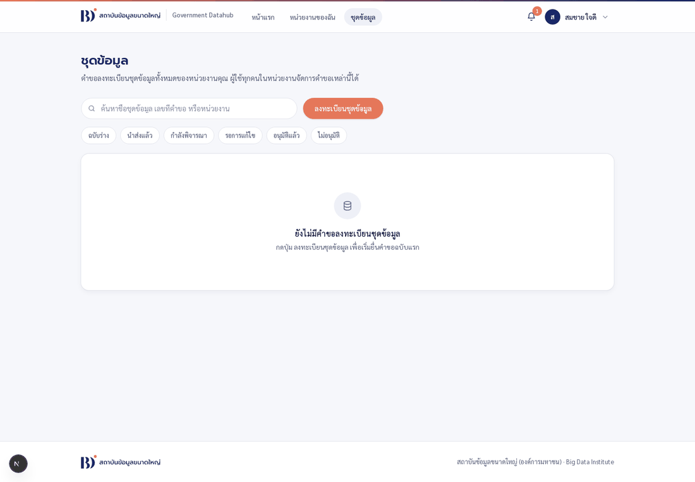

หน้านี้รวม **คำขอทั้งหมดของหน่วยงานคุณ** ไว้ที่เดียว โดยผู้ดำเนินการทุกคนในหน่วยงาน
เห็นและแก้ไขได้หมด ไม่จำเป็นต้องเป็นคนสร้างเอง จากนั้นกด **ลงทะเบียนชุดข้อมูล**

ระบบจะออก **เลขที่คำขอ** ให้ทันที (เช่น `DS-REG-2026-0010`) แล้วพาเข้าแบบฟอร์ม

### 2.2 แบบฟอร์มแบ่งเป็นห้าส่วน

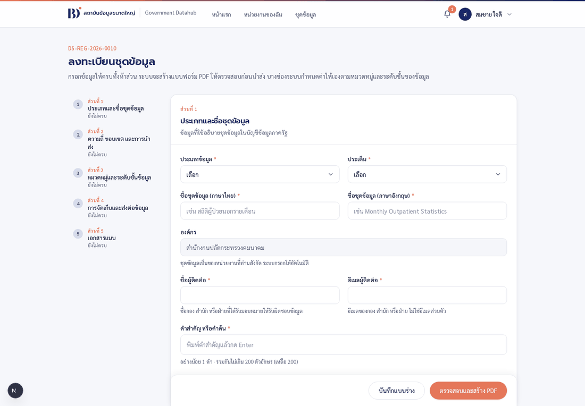

| ส่วน | กรอกอะไรบ้าง |
| --- | --- |
| **1 — ประเภทและชื่อชุดข้อมูล** | ประเภทข้อมูล · ประเด็น · ชื่อไทย/อังกฤษ · ผู้ติดต่อและอีเมล · คำสำคัญ · รายละเอียด · วัตถุประสงค์ |
| **2 — ความถี่ ขอบเขต และการนำส่ง** | ความถี่ปรับปรุงข้อมูลต้นทาง · ความถี่นำส่ง · ความละเอียดเชิงภูมิศาสตร์ · แหล่งที่มา · รูปแบบการนำส่ง |
| **3 — หมวดหมู่และระดับชั้นข้อมูล** | หมวดหมู่ตามธรรมาภิบาล · มีข้อมูลส่วนบุคคลหรือไม่ · ระดับชั้นข้อมูล · สัญญาอนุญาต |
| **4 — การจัดเก็บและส่งต่อข้อมูล** | คำถามอนุญาต/ไม่อนุญาต 5 ข้อ และติ๊กยืนยันความถูกต้อง |
| **5 — เอกสารแนบ** | พจนานุกรมข้อมูล (**บังคับ**) · ตัวอย่างข้อมูล (ถ้ามี) |

**ช่อง องค์กร ระบบเติมให้เอง** เป็นหน่วยงานที่คุณสังกัด และแก้ไม่ได้

### 2.3 เรื่องที่ต้องรู้ในแต่ละส่วน

**ส่วนที่ 1**

- **คำสำคัญ** พิมพ์คำแล้วกด **Enter** คำนั้นจะกลายเป็นป้ายคำ พิมพ์เพิ่มได้เรื่อย ๆ
  ต้องมีอย่างน้อย 1 คำ และรวมกันไม่เกิน 200 ตัวอักษร (มีตัวนับบอกว่าเหลือกี่ตัว)
- **รายละเอียด** และ **วัตถุประสงค์** ต้องยาวอย่างน้อย **30 ตัวอักษร** ต่อช่อง
- **ชื่อผู้ติดต่อ** ให้ใส่ชื่อ **กอง/สำนัก/ฝ่าย** ที่รับผิดชอบ ไม่ใช่ชื่อบุคคล
  ส่วน **อีเมลผู้ติดต่อ** ก็ต้องเป็นอีเมลของหน่วยงาน ไม่ใช่อีเมลส่วนตัว

**ส่วนที่ 2**

- พอเลือก **หน่วยความถี่** เป็นหน่วยที่ต้องระบุจำนวน (ปี ไตรมาส เดือน …)
  จะมี **ช่องใหม่โผล่ขึ้นมาข้าง ๆ** ให้กรอกตัวเลข เช่นถ้าปรับปรุงทุก 2 เดือน ให้กรอก `2`
  **ช่องนี้บังคับ และมักถูกมองข้าม** เพราะช่องนี้เพิ่งโผล่มาหลังจากเลือกหน่วยไปแล้ว
- ถ้าเลือก **รูปแบบการนำส่ง** เป็น "ผ่านระบบเชื่อมโยงข้อมูลอื่น" จะต้องระบุชื่อระบบเพิ่มด้วย

**ส่วนที่ 3 — ส่วนที่มีเงื่อนไขเยอะที่สุด**

**หมวดหมู่ที่เลือกจะเป็นตัวกำหนดว่าเลือกอะไรได้ต่อ** ช่อง *ระดับชั้นข้อมูล* กับ *สัญญาอนุญาต*
จะถูกล็อกไว้ก่อน จนกว่าจะเลือกช่องที่อยู่เหนือมันเสร็จ

| ถ้าเลือกหมวดหมู่ | ระดับชั้นข้อมูลที่เลือกได้ | ผลที่ตามมา |
| --- | --- | --- |
| ข้อมูลสาธารณะ | **เปิดเผย** อย่างเดียว | ระบบล็อกสัญญาอนุญาตเป็น **Open Data Common** ให้เอง |
| ข้อมูลใช้ภายใน | เผยแพร่ภายในองค์กร · ลับ · ลับมาก · ลับที่สุด | เลือกสัญญาอนุญาตต่อได้ |
| ข้อมูลความลับทางราชการ / ข้อมูลความมั่นคง | ชั้นความลับตาม พ.ร.บ.ข้อมูลข่าวสารฯ | เลือกสัญญาอนุญาตต่อได้ |

> ถ้าเจอช่องสีเทาที่กดไม่ได้ **ไม่ใช่ระบบเสีย** ให้ย้อนขึ้นไปเลือกช่องด้านบนก่อน
> ข้อความใต้ช่องเขียนบอกไว้แล้วว่า "เลือกหมวดหมู่ข้อมูลก่อน จึงจะเลือกระดับชั้นได้"

**ถ้าตอบว่า "มี" ข้อมูลส่วนบุคคล จะมีช่องเพิ่มขึ้นมาอีกสามช่อง**

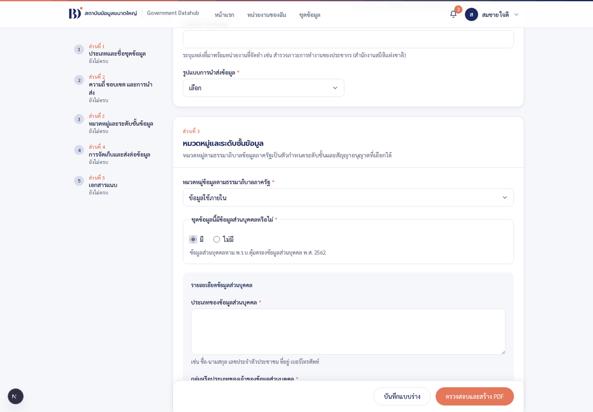

- ประเภทของข้อมูลส่วนบุคคล (เช่น ชื่อ-นามสกุล เลขประจำตัวประชาชน)
- กลุ่มหรือประเภทของเจ้าของข้อมูลส่วนบุคคล
- ระยะเวลาประมวลผลข้อมูลส่วนบุคคล (ถ้าเลือก "ระบุระยะเวลา" จะมีช่องปี/เดือนโผล่มาอีก)

**ส่วนที่ 4**

เป็นคำถาม 5 ข้อว่าอนุญาตให้ BDI เก็บและส่งต่อข้อมูลได้แค่ไหน
**"อนุญาต" หมายถึงส่งต่อได้ทันที ส่วน "ไม่อนุญาต" หมายถึงต้องมาขออนุญาตเป็นครั้ง ๆ ไป**
ปิดท้ายด้วยการ **ติ๊กยืนยัน** ว่าข้อมูลถูกต้องและหน่วยงานมีอำนาจนำส่ง — ช่องนี้บังคับ

**ส่วนที่ 5**

- **พจนานุกรมข้อมูล (Data Dictionary) บังคับแนบ** รับ PDF, XLSX หรือ CSV ไม่เกิน 10 MB
- ตัวอย่างข้อมูล แนบเพิ่มได้ถ้ามี รับ CSV, XLSX หรือ JSON ไม่เกิน 10 MB

### 2.4 ให้ระบบตรวจความครบถ้วน

กด **ตรวจสอบและสร้าง PDF** ระบบจะไล่ตรวจทั้งฉบับ ถ้ายังไม่ครบจะขึ้นข้อความสีแดง
ใต้ทุกช่องที่มีปัญหา พร้อมข้อความแจ้งเตือนที่มุมล่างขวาว่าเหลือกี่รายการที่ต้องแก้

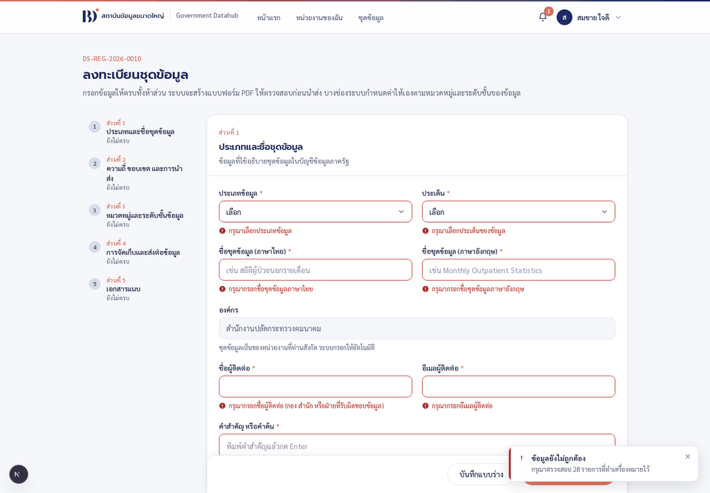

พอกรอกครบแล้ว ทั้งห้าส่วนในแถบซ้ายจะเปลี่ยนเป็นสีเขียว

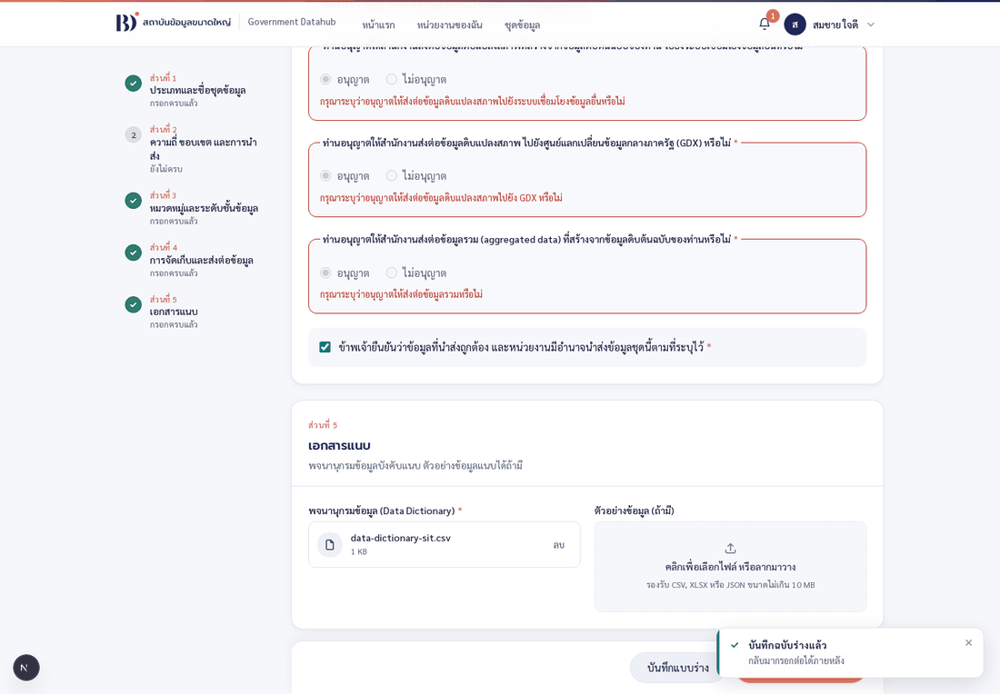

> ระหว่างทางกด **บันทึกแบบร่าง** ได้ตลอด ไม่บังคับว่าต้องกรอกครบก่อน

### 2.5 ตรวจ PDF แล้วนำส่ง

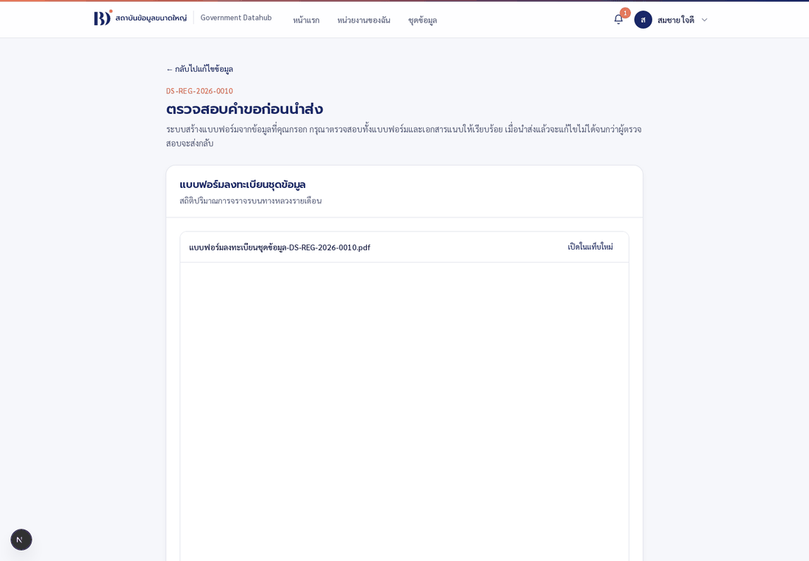

หน้านี้แสดงทั้ง **แบบฟอร์ม PDF** และ **รายการเอกสารแนบ** ให้ตรวจอีกรอบว่าไฟล์ที่แนบเป็นฉบับล่าสุด

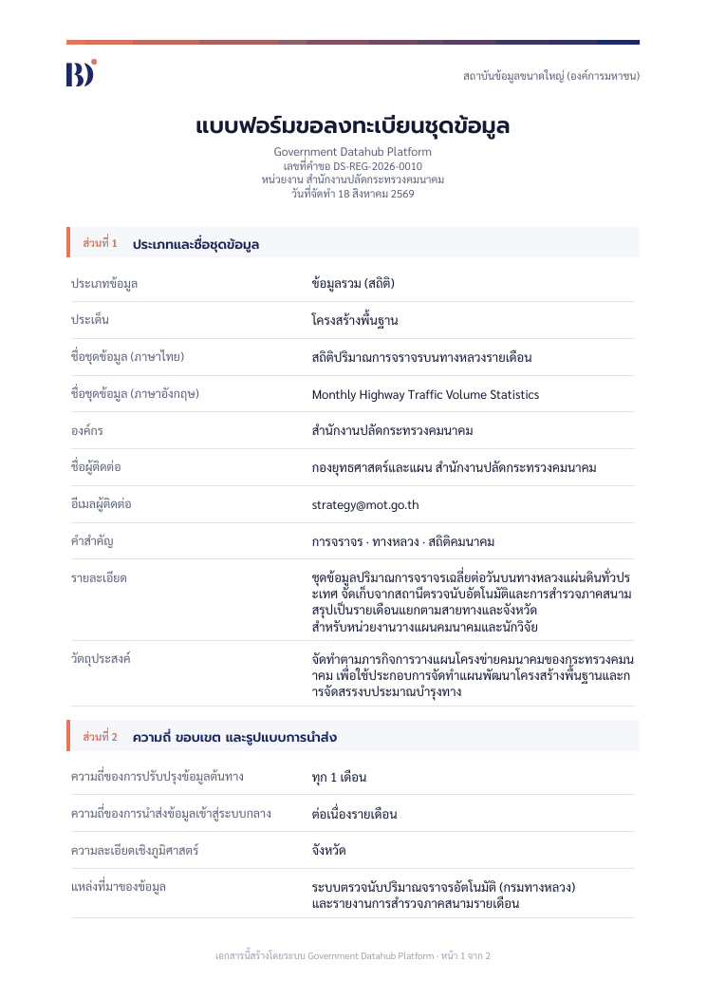

ตรวจเรียบร้อยแล้วกด **นำส่งคำขอ**

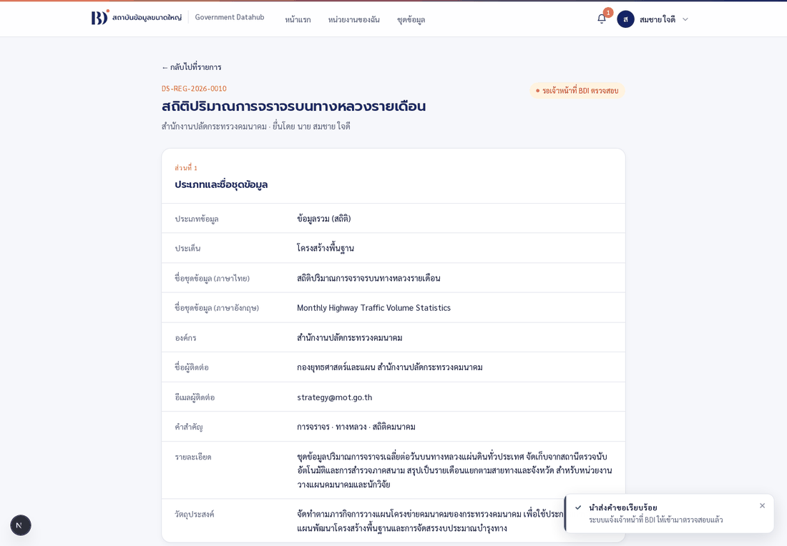

สถานะจะเป็น **รอเจ้าหน้าที่ BDI ตรวจสอบ** · **แก้ไขไม่ได้อีก** ·
และระบบส่งอีเมลกับการแจ้งเตือนถึงเจ้าหน้าที่ BDI ทุกคน

---

## 3. ขั้นที่ 2 — เจ้าหน้าที่ BDI ตรวจสอบ

**สลับไปใช้บัญชีเจ้าหน้าที่ BDI** แล้วกดเมนู **ชุดข้อมูล**

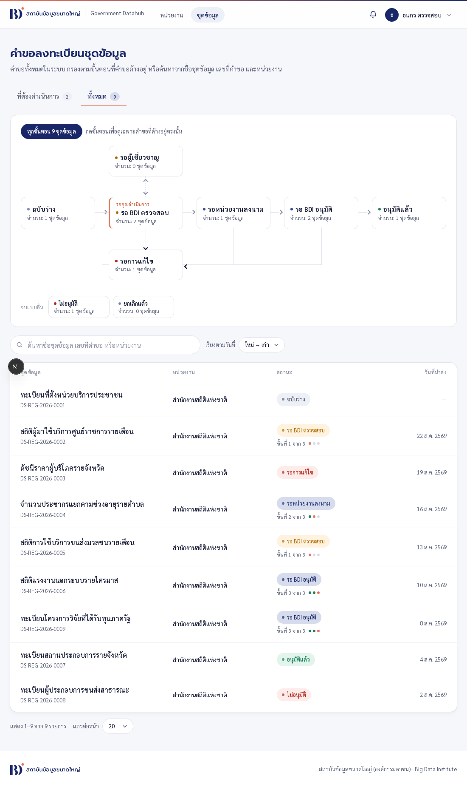

เจ้าหน้าที่ BDI **เห็นคำขอทั้งหมดในระบบ** และใช้แผนภาพเส้นทาง แท็บ ตัวเรียงตามวันที่
และช่องค้นหาได้เหมือนหน้าหน่วยงาน เส้นทางชุดข้อมูลมีสามขั้นเท่ากับเส้นทางหน่วยงาน
ต่างกันแค่ทางแยกผู้เชี่ยวชาญ:

- มีกล่อง **รอผู้เชี่ยวชาญ** ลอยอยู่ **เหนือ** ขั้น *รอ BDI ตรวจสอบ* เชื่อมด้วย **เส้นประที่มี
  หัวลูกศรทั้งขึ้นและลง** — ออกไปแล้วกลับเข้าด่านเดิม ไม่ใช่ทางผ่านไปขั้นถัดไป เส้นเป็นเส้นประ
  เพราะเป็นขั้นที่ไม่บังคับ (กล่องขึ้นเสมอแม้จำนวนเป็น 0 เพื่อบอกว่าทางแยกนี้มีอยู่ และเอาเมาส์
  ชี้ที่เส้นจะมีคำอธิบายขึ้น)
- กล่องของเจ้าหน้าที่ BDI มี **กล่องเดียว** คือ *รอ BDI ตรวจสอบ* ถ้าคุณเป็นเจ้าหน้าที่ BDI
  กล่องนี้จะเป็นสีเขียวเพราะเป็นงานของคุณ
- ลูกศรที่วิ่งเข้ากล่อง **รอการแก้ไข** มาจากสามขั้น: *รอ BDI ตรวจสอบ* ดิ่งลงเข้าด้านบน ส่วน
  *รอหน่วยงานลงนาม* กับ *รอ BDI อนุมัติ* วิ่งอ้อมมาเข้าด้านขวา และมีลูกศรออกจากด้านซ้ายของ
  กล่องนั้นวนกลับขึ้นไปเข้า *รอ BDI ตรวจสอบ* — คือเส้นทาง "แก้แล้วนำส่งใหม่" ซึ่งกลับมาที่
  ขั้นแรกเสมอ ไม่ว่าจะถูกส่งกลับจากขั้นไหน

เปิดคำขอขึ้นมา จะเห็นการ์ด **รอการพิจารณาของคุณ** พร้อมปุ่มครบชุด

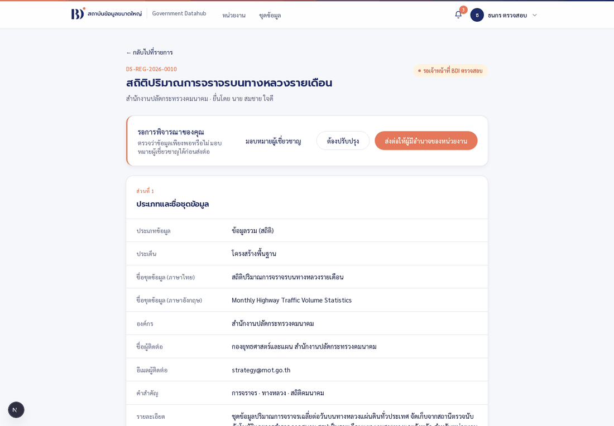

| ปุ่ม | ทำอะไร |
| --- | --- |
| **มอบหมายผู้เชี่ยวชาญ** | ส่งให้ผู้เชี่ยวชาญข้อมูลช่วยตรวจก่อน (ไม่บังคับ) |
| **ต้องปรับปรุง** | ส่งกลับให้หน่วยงานแก้ (ต้องพิมพ์เหตุผลอย่างน้อย 10 ตัวอักษร) |
| **ส่งต่อให้ผู้มีอำนาจของหน่วยงาน** | ส่งไปด่านที่ 2 |

### 3.1 มอบหมายผู้เชี่ยวชาญ (ไม่บังคับ)

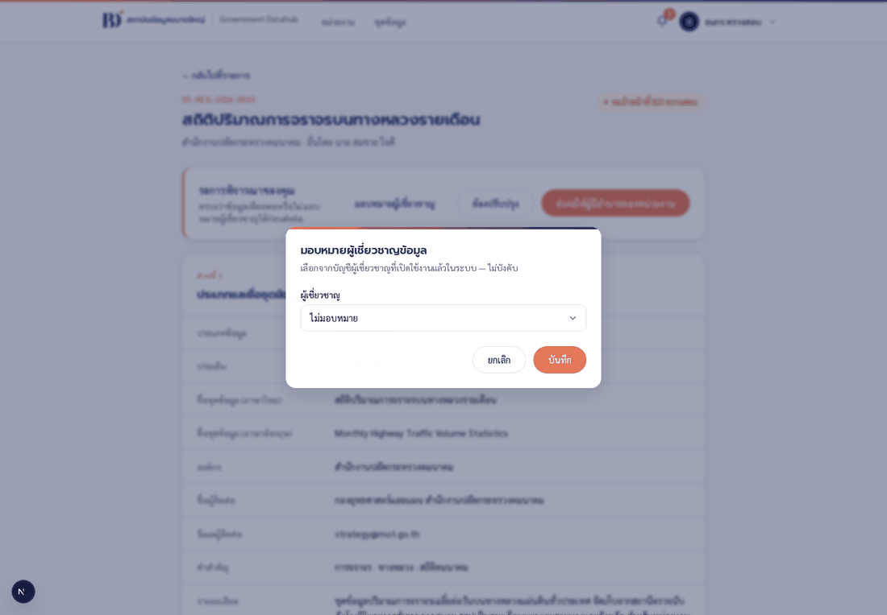

เลือกผู้เชี่ยวชาญจากรายการแล้วกด **บันทึก** สถานะจะเปลี่ยนเป็น
**รอผู้เชี่ยวชาญด้านข้อมูลพิจารณา** และผู้เชี่ยวชาญจะได้รับทั้งอีเมลและการแจ้งเตือน

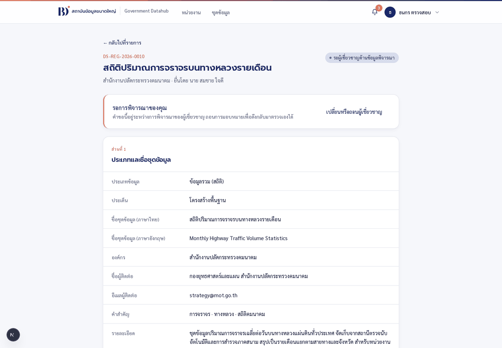

ระหว่างที่คำขออยู่กับผู้เชี่ยวชาญ เจ้าหน้าที่จะทำได้อย่างเดียวคือ
**เปลี่ยนหรือถอนผู้เชี่ยวชาญ** (เลือก "ไม่มอบหมาย" ในกล่องเดิม เพื่อดึงคำขอกลับมาตรวจเอง)

ด้านล่างของหน้าจะมีการ์ด **ผู้เชี่ยวชาญที่ได้รับมอบหมาย** โผล่ขึ้นมา
บอกชื่อ อีเมล และเวลาที่มอบหมาย

### 3.2 ผู้เชี่ยวชาญตรวจและบันทึกความเห็น

**สลับไปใช้บัญชีผู้เชี่ยวชาญ** (`specialist@bdi.or.th`)

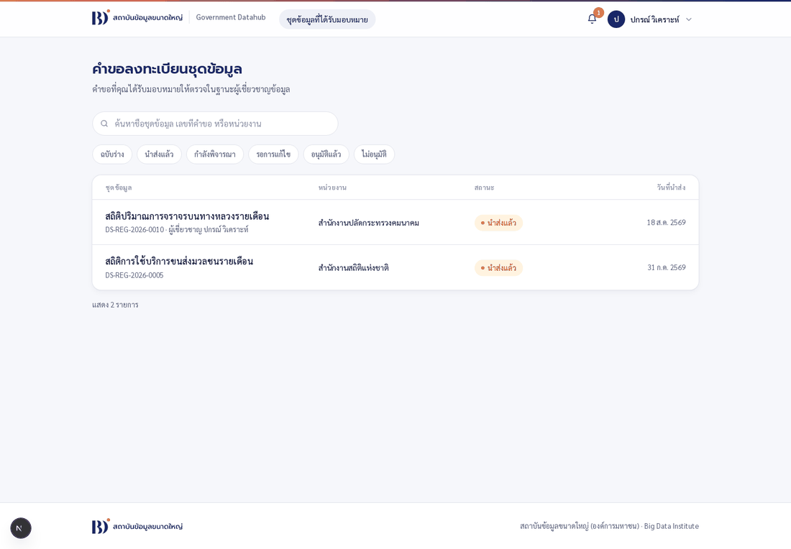

> ผู้เชี่ยวชาญ **เห็นเฉพาะคำขอที่ถูกมอบหมายให้ตัวเอง** เท่านั้น และมีเมนูเดียวคือ
> **ชุดข้อมูลที่ได้รับมอบหมาย** ถ้าเห็นคำขอของหน่วยงานอื่นที่ไม่ได้ถูกมอบหมาย ให้แจ้งทีมพัฒนา

เปิดคำขอขึ้นมา จะมีให้เลือกสองปุ่ม


| ปุ่ม | ผลที่ตามมา |
| --- | --- |
| **บันทึกความเห็น** | ความเห็นขึ้นในประวัติการดำเนินการ แล้ว **ส่งคำขอกลับให้เจ้าหน้าที่ BDI ตัดสินใจต่อ** |
| **ต้องปรับปรุง** | ส่งกลับให้หน่วยงานแก้ได้เลย ไม่ต้องผ่านเจ้าหน้าที่ |

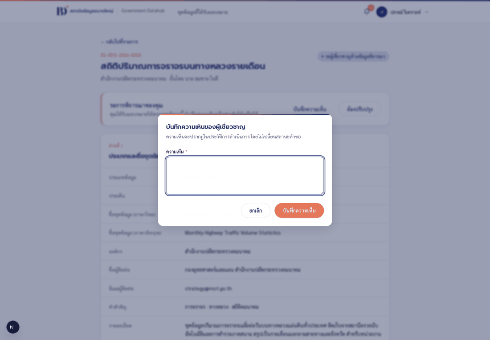

ความเห็นที่บันทึกจะขึ้นในประวัติการดำเนินการ ให้ทุกฝ่ายอ่านได้

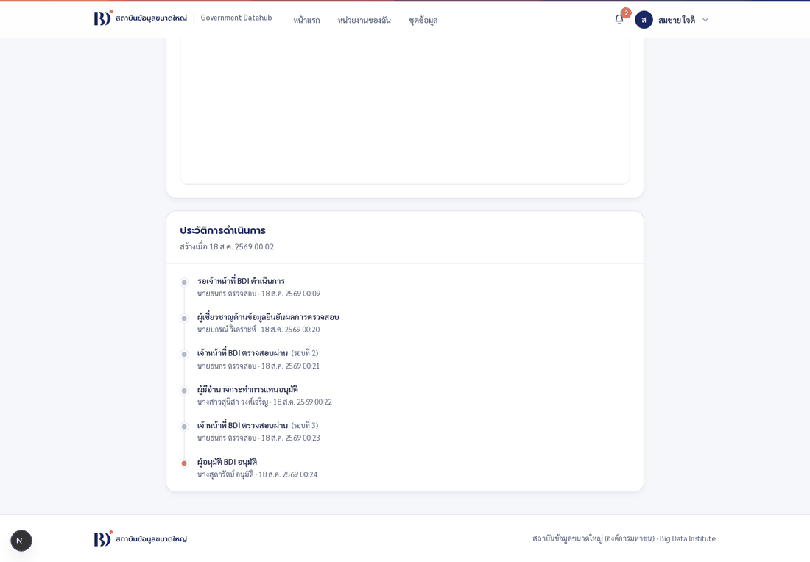

### 3.3 เจ้าหน้าที่ส่งต่อ

**กลับไปใช้บัญชีเจ้าหน้าที่ BDI** แล้วกด **ส่งต่อให้ผู้มีอำนาจของหน่วยงาน**

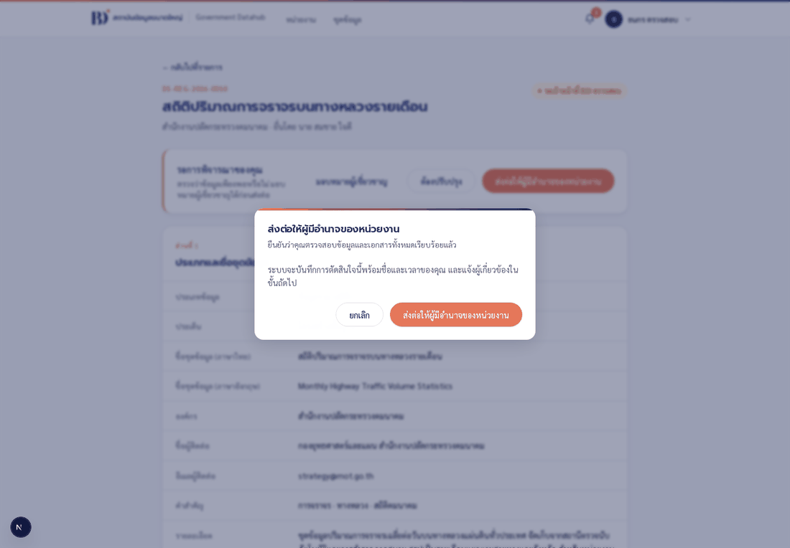

สถานะจะเป็น **รอผู้มีอำนาจของหน่วยงานลงนาม**

### 3.4 ถ้าเลือกส่งกลับให้แก้แทน

กด **ต้องปรับปรุง** แล้วพิมพ์สิ่งที่ต้องแก้อย่างน้อย 10 ตัวอักษร

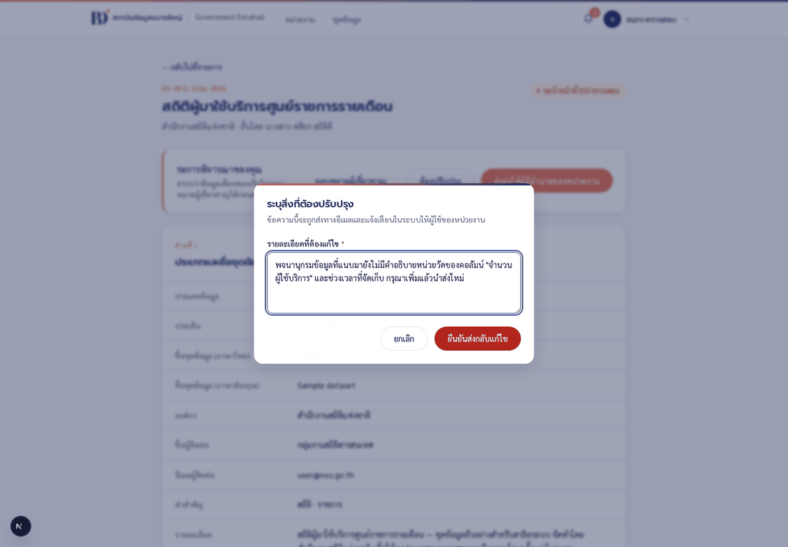

ฝั่งหน่วยงานจะเห็นกล่องสีแดงบอกครบทั้ง **สิ่งที่ต้องแก้ · โดยใคร · เมื่อไหร่**
พร้อมปุ่ม **แก้ไขคำขอ**

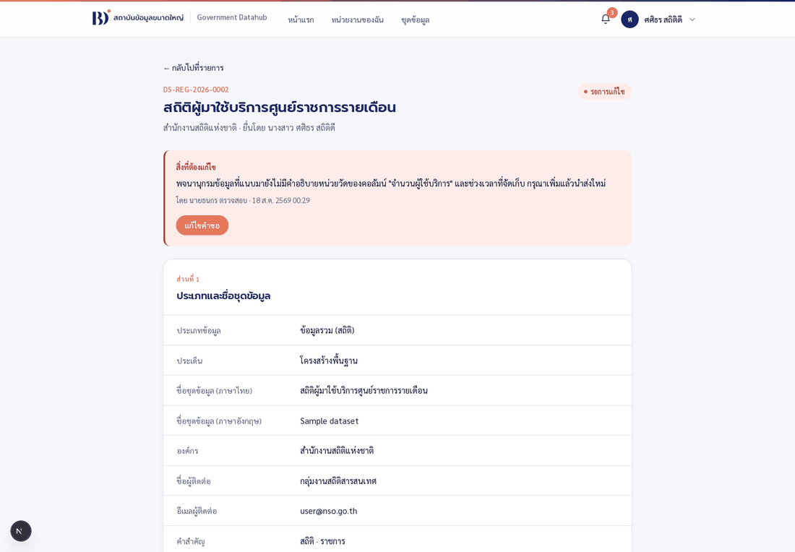

แก้แล้วนำส่งใหม่ คำขอจะ **กลับไปเริ่มที่ด่านที่ 1 เสมอ**

---

## 4. ขั้นที่ 3 — ผู้มีอำนาจกระทำการแทนลงนาม

**สลับไปใช้บัญชีผู้มีอำนาจกระทำการแทน** หน้าแรกจะมีการ์ดสีส้ม
**รอคุณพิจารณาและลงนาม** พร้อมปุ่ม **เริ่มพิจารณา**

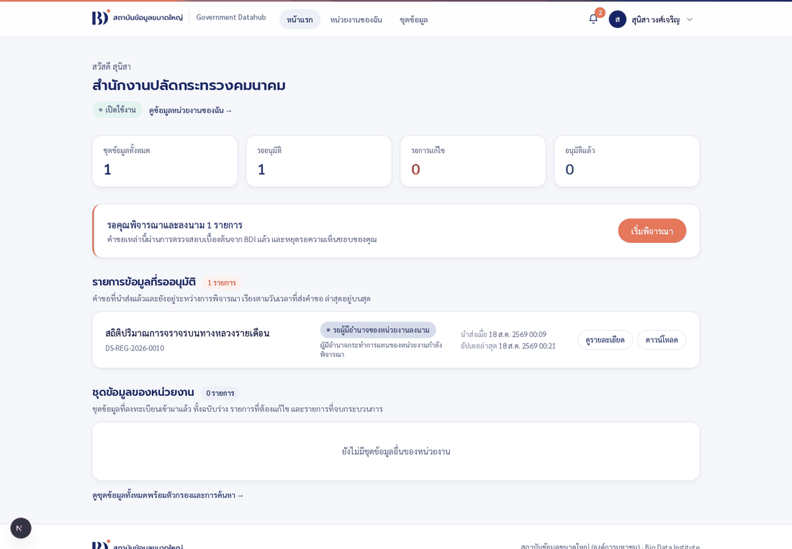

เปิดคำขอ ตรวจแบบฟอร์มและเอกสารแนบให้เรียบร้อย แล้วกด **เห็นชอบและลงนาม**

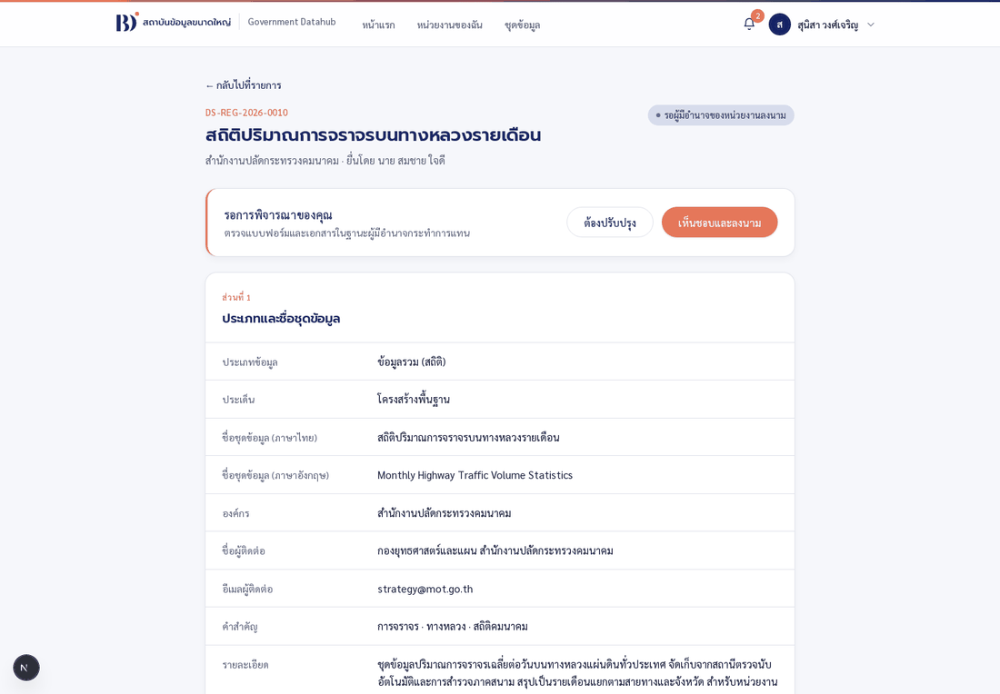

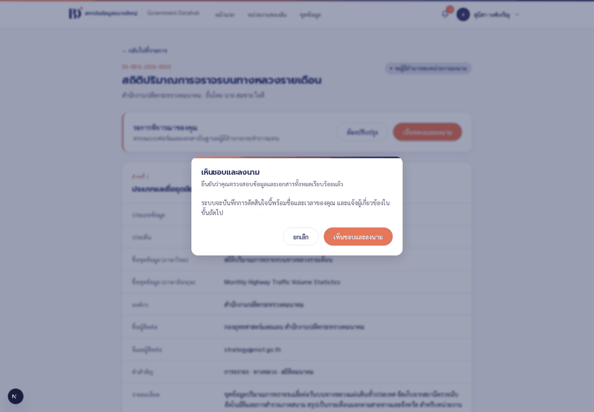

ระบบจะบันทึกชื่อผู้ลงนามกับเวลาไว้ และจะเอาไปพิมพ์ลงเอกสารฉบับอนุมัติในขั้นสุดท้าย
จากนั้นสถานะจะไปเป็น **รอ BDI อนุมัติขั้นสุดท้าย** ทันที และผู้อนุมัติ BDI ทุกคนได้รับอีเมล
ที่ระบุชื่อผู้ลงนาม

> **เจ้าหน้าที่ BDI ไม่ต้องทำอะไรอีกหลังจากนี้** เดิมคำขอจะย้อนกลับไปให้เจ้าหน้าที่ "ตรวจซ้ำ"
> ก่อนหนึ่งรอบ ขั้นนั้นถูกยกเลิกเมื่อ 2026-08-30 **ถ้าหลังการลงนามคำขอยังไปโผล่ที่คิวของ
> เจ้าหน้าที่ BDI ให้ถือว่าเป็นข้อผิดพลาดและแจ้งทีมพัฒนา**

---

## 5. ขั้นที่ 4 — ผู้อนุมัติ BDI

**สลับไปใช้บัญชีผู้อนุมัติ BDI** เปิดคำขอขึ้นมา จะเห็นสามปุ่มให้เลือก

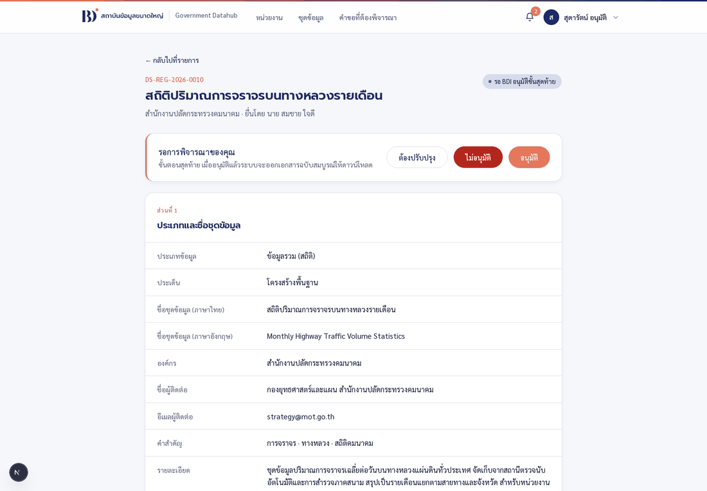

| ปุ่ม | ผลที่ตามมา |
| --- | --- |
| **ต้องปรับปรุง** | กลับไปเป็น **รอการแก้ไข** ให้หน่วยงานแก้ |
| **ไม่อนุมัติ** | **ปิดคำขอถาวร** ย้อนกลับไม่ได้ และต้องระบุเหตุผล |
| **อนุมัติ** | ขึ้นสถานะ **อนุมัติแล้ว** และระบบสร้างเอกสารฉบับสมบูรณ์ให้ |

### 5.1 ถ้าเลือกอนุมัติ

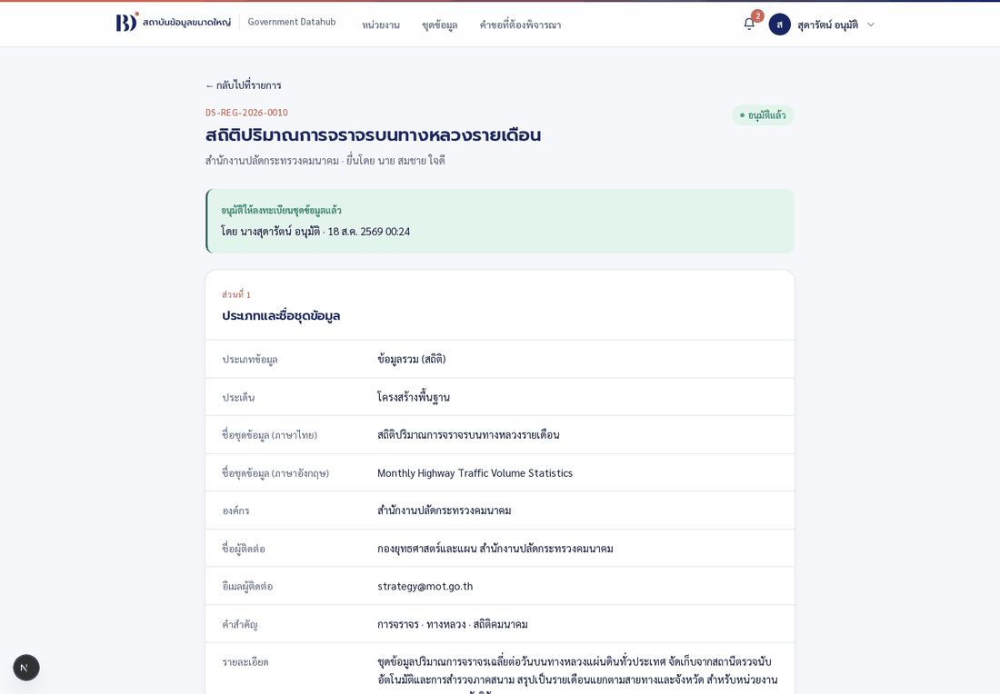

กล่องสีเขียวจะบอกว่า **อนุมัติให้ลงทะเบียนชุดข้อมูลแล้ว โดย &lt;ชื่อผู้อนุมัติ&gt; · &lt;วันเวลา&gt;**
และมีการ์ด **เอกสารฉบับอนุมัติ** ให้ดาวน์โหลด

เอกสารฉบับนี้ **ไม่ใช่ไฟล์เดิมที่เคยสร้างตอนนำส่ง** แต่เป็นฉบับที่ระบบสร้างขึ้นใหม่ตอนอนุมัติ
จึงมีครบทั้งชื่อผู้ยื่น ชื่อผู้มีอำนาจกระทำการแทน วันที่ลงนามของทั้งคู่
และตราประทับอนุมัติสีเขียว

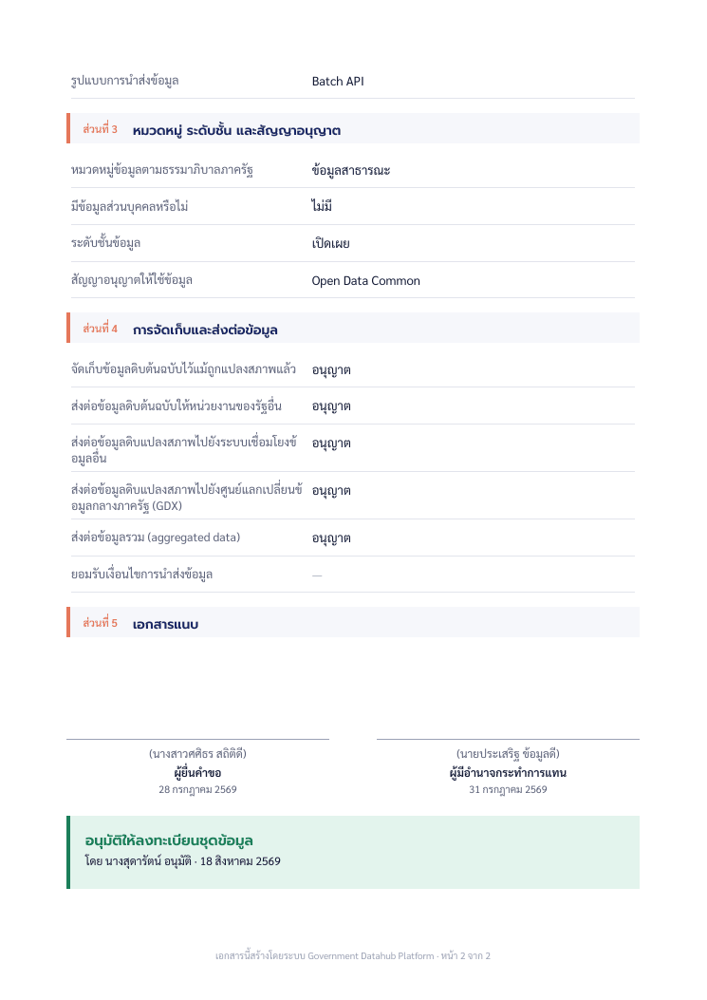

### 5.2 ถ้าเลือกไม่อนุมัติ

กด **ไม่อนุมัติ** แล้วพิมพ์เหตุผล

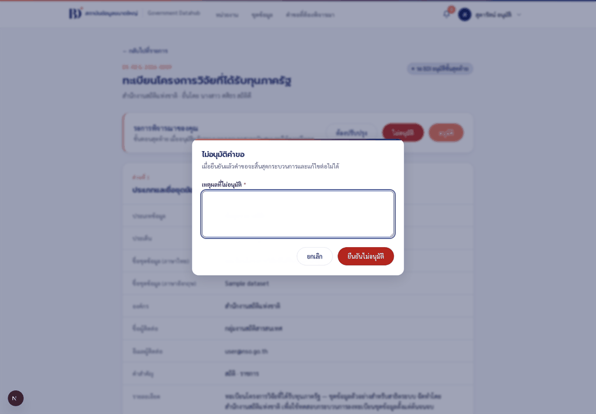

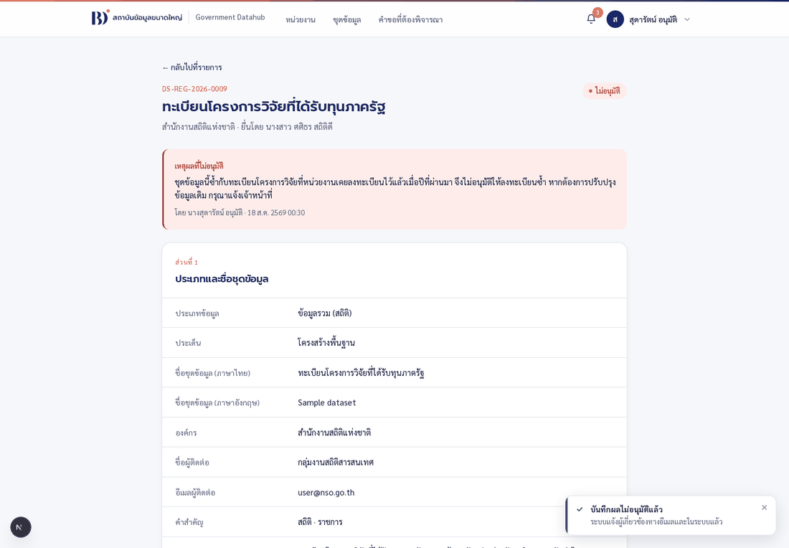

กล่องสีแดงจะแสดง **เหตุผลที่ไม่อนุมัติ** พร้อมชื่อผู้ตัดสินและเวลา
คำขอถูกปิดถาวร และระบบแจ้งผู้เกี่ยวข้องทุกคน

---

## 6. ดูผลย้อนหลัง

เลื่อนลงล่างสุดของหน้ารายละเอียด **ประวัติการดำเนินการ** ต้องเรียงครบทุกด่านตามที่เกิดขึ้นจริง
พร้อมชื่อผู้ทำ เวลา ความเห็นของผู้เชี่ยวชาญ และข้อความตอนที่ส่งกลับให้แก้


---

## 7. รายการทดสอบของเล่ม C

**ช่วงกรอกและนำส่ง**

- [ ] หน่วยงานที่ยังไม่เปิดใช้งาน → ปุ่ม **ลงทะเบียนชุดข้อมูล** กดไม่ได้ และบอกว่าติดอะไร
- [ ] กดลงทะเบียนแล้วได้เลขที่คำขอ `DS-REG-<ปี>-<ลำดับ>` ทันที
- [ ] ช่อง **องค์กร** ถูกเติมเป็นหน่วยงานของคุณเอง และแก้ไม่ได้
- [ ] คำสำคัญ: พิมพ์แล้วกด Enter กลายเป็นป้ายคำ ลบได้ และตัวนับตัวอักษรลดลงถูกต้อง
- [ ] รายละเอียดหรือวัตถุประสงค์สั้นกว่า 30 ตัวอักษร → ไม่ผ่าน
- [ ] เลือกหน่วยความถี่แล้ว **ช่องค่าความถี่โผล่ขึ้นมา** และบังคับให้กรอก
- [ ] เลือกหมวดหมู่ **ข้อมูลสาธารณะ** → ระดับชั้นและสัญญาอนุญาตถูกล็อกให้อัตโนมัติ
- [ ] เลือกหมวดหมู่ **ข้อมูลใช้ภายใน** → เลือกระดับชั้นได้ 4 แบบ
- [ ] ตอบว่า **มี** ข้อมูลส่วนบุคคล → มีช่องเพิ่มขึ้นสามช่อง และบังคับกรอก
- [ ] ไม่ติ๊กยืนยันความถูกต้องในส่วนที่ 4 → นำส่งไม่ได้
- [ ] ไม่แนบพจนานุกรมข้อมูล → นำส่งไม่ได้
- [ ] กด **ตรวจสอบและสร้าง PDF** ตอนยังไม่ครบ → ข้อความแจ้งเตือน **เป็นภาษาไทยทุกช่อง**
- [ ] PDF ที่สร้างแสดงข้อมูลครบทั้งห้าส่วน และอ่านภาษาไทยได้ถูกต้อง
- [ ] นำส่งแล้วแก้ไขไม่ได้

**ช่วงตรวจสอบและอนุมัติ**

- [ ] เจ้าหน้าที่ BDI เห็นคำขอทั้งหมดในระบบ
- [ ] มอบหมายผู้เชี่ยวชาญได้ และผู้เชี่ยวชาญได้รับการแจ้งเตือน
- [ ] **ผู้เชี่ยวชาญเห็นเฉพาะคำขอที่ถูกมอบหมายให้ตัวเอง** (ไม่เห็นของหน่วยงานอื่น)
- [ ] เจ้าหน้าที่ **ถอนการมอบหมาย** ได้ และคำขอกลับมาอยู่ที่ตัวเอง
- [ ] ผู้เชี่ยวชาญ **บันทึกความเห็น** → ความเห็นขึ้นในประวัติ และคำขอกลับไปหาเจ้าหน้าที่
- [ ] ผู้เชี่ยวชาญกด **ต้องปรับปรุง** → ส่งกลับหน่วยงานได้โดยตรง
- [ ] เจ้าหน้าที่ส่งกลับให้แก้ → ฝั่งหน่วยงานเห็น **สิ่งที่ต้องแก้ · โดยใคร · เมื่อไหร่**
- [ ] แก้แล้วนำส่งใหม่ → กลับไปเริ่มด่านที่ 1
- [ ] ผู้มีอำนาจเห็นการ์ด **รอคุณพิจารณาและลงนาม** บนหน้าแรก
- [ ] ผู้มีอำนาจกด **เห็นชอบและลงนาม** → คำขอไปที่ผู้อนุมัติ BDI **ทันที**
- [ ] **หลังลงนาม คำขอต้องไม่กลับไปโผล่ในคิวของเจ้าหน้าที่ BDI อีก**
- [ ] ผู้อนุมัติ BDI ได้รับอีเมลที่ระบุ **ชื่อผู้ลงนาม**
- [ ] ผู้อนุมัติ BDI กด **ต้องปรับปรุง** → แก้แล้วนำส่งใหม่ **ต้องเดินผ่านการลงนามอีกครั้ง**
- [ ] ผู้อนุมัติ BDI กด **อนุมัติ** → สถานะ **อนุมัติแล้ว** และกล่องสีเขียวบอกชื่อผู้อนุมัติ
- [ ] **เอกสารฉบับอนุมัติมีลายเซ็นทั้งสองฝ่าย วันที่ และตราประทับอนุมัติ**
- [ ] ผู้อนุมัติ BDI กด **ไม่อนุมัติ** → กล่องสีแดงแสดงเหตุผล ชื่อผู้ตัดสิน และเวลา
- [ ] ประวัติการดำเนินการเรียงครบทุกด่านตามที่เกิดขึ้นจริง

---

## 8. ห้าจุดที่ทีมพัฒนาอยากให้ช่วยจับตาเป็นพิเศษ

ทั้งห้าข้อนี้เคยเป็นข้อผิดพลาดที่แก้ไปแล้ว ถ้ากลับมาอีกแปลว่ามีอะไรพัง ช่วยแจ้งทีมพัฒนาด้วย

1. **ข้อความแจ้งข้อผิดพลาดต้องเป็นภาษาไทยเสมอ** ถ้าเจอข้อความภาษาอังกฤษที่ขึ้นต้นด้วย
   `Invalid input:` ให้ถ่ายภาพหน้าจอส่งทีมพัฒนา
2. **ชื่อคนต้องไม่ขึ้นเป็นขีด (—)** ทั้งในกล่องสรุปผลอนุมัติ/ไม่อนุมัติ และในการ์ดผู้เชี่ยวชาญ
3. **หลังผู้มีอำนาจลงนาม คำขอต้องไปที่ผู้อนุมัติ BDI ตรงไปตรงมา** ไม่มีขั้นตรวจซ้ำของ
   เจ้าหน้าที่ BDI คั่นอีกแล้ว
4. **เมนูทุกอันต้องกดแล้วไปถึงหน้าที่มีอยู่จริง** ไม่ใช่หน้า "ไม่พบ…"
5. **หลังกดอนุมัติขั้นสุดท้าย ต้องได้เอกสารฉบับใหม่ที่มีลายเซ็นครบ**
   ไม่ใช่ไฟล์เดิมที่สร้างไว้ตั้งแต่ก่อนนำส่ง

---

**กลับไปที่:** [เล่มภาพรวม](12-tester-manual-overview.md) · [เล่ม A](13-tester-manual-journey-a.md) · [เล่ม B](14-tester-manual-journey-b.md)
