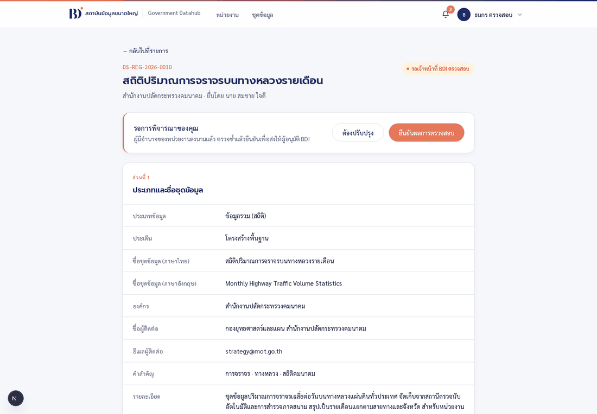

# เล่ม C — ลงทะเบียนชุดข้อมูลจนได้รับอนุมัติ

**เขียนสำหรับผู้ทดสอบทั่วไป ไม่ต้องมีความรู้ทางเทคนิค**
ทุกภาพในคู่มือถ่ายจากระบบจริงระหว่างการทดสอบเมื่อ 17–18 สิงหาคม 2569

> ต้องอ่าน [เล่มภาพรวม](12-tester-manual-overview.md) ก่อน
> และหน่วยงานของคุณต้องผ่าน [เล่ม B](14-tester-manual-journey-b.md) จนขึ้นสถานะ **เปิดใช้งาน** แล้ว

---

## เส้นทางทั้งหมดของเล่มนี้

```
  คุณ (ผู้ดำเนินการของหน่วยงาน)
      │  กรอกแบบฟอร์ม 5 ส่วน → ตรวจ PDF → นำส่ง
      ▼
  ┌──────────────────────────┐                 ┌──────────────────┐
  │ รอเจ้าหน้าที่ BDI ตรวจสอบ     │ ──ต้องปรับปรุง──▶ │  รอการแก้ไข        │
  │      (ด่านที่ 1)            │ ◀───แก้แล้วส่งใหม่── │                  │
  └────┬─────────────────┬───┘                 └──────────────────┘
       │ มอบหมาย          │ ส่งต่อ
       ▼ (ไม่บังคับ)       │
  ┌──────────────────────┐│
  │ รอผู้เชี่ยวชาญพิจารณา    ││  บันทึกความเห็น → คืนให้เจ้าหน้าที่
  └──────────┬───────────┘│
             └────────────┤
                          ▼
              ┌──────────────────────────┐
              │ รอผู้มีอำนาจของหน่วยงานลงนาม │  (ด่านที่ 2)
              └──────────┬───────────────┘
                         ▼
              ┌──────────────────────────┐
              │ รอเจ้าหน้าที่ BDI ตรวจซ้ำ     │  (ด่านที่ 3 — รอบที่สองของเจ้าหน้าที่คนเดิม)
              └──────────┬───────────────┘
                         ▼
              ┌──────────────────────┐    ไม่อนุมัติ    ┌──────────┐
              │ รอ BDI อนุมัติขั้นสุดท้าย  │ ────────────▶ │ ไม่อนุมัติ │ ปิดถาวร
              └──────────┬───────────┘                └──────────┘
                         │ อนุมัติ
                         ▼
                   ✅ อนุมัติแล้ว + ได้เอกสารฉบับอนุมัติ
```

**ต้องใช้ 5 บัญชี**

| ขั้น | ใช้บัญชี | ตัวอย่างในคู่มือนี้ |
| --- | --- | --- |
| 1 | ผู้ดำเนินการของหน่วยงาน | `somchai.tester@mot.go.th` |
| 2 | เจ้าหน้าที่ BDI | `officer@bdi.or.th` |
| 2.5 | ผู้เชี่ยวชาญข้อมูล BDI (ไม่บังคับ) | `specialist@bdi.or.th` |
| 3 | ผู้มีอำนาจกระทำการแทน | `director.tester@mot.go.th` |
| 4 | ผู้อนุมัติ BDI | `approver@bdi.or.th` |

---

## 1. เงื่อนไขก่อนเริ่ม

ปุ่ม **ลงทะเบียนชุดข้อมูล** จะกดได้ก็ต่อเมื่อครบทั้งสามข้อ

1. คุณเป็น **ผู้ดำเนินการของหน่วยงาน**
2. หน่วยงานของคุณอยู่ในสถานะ **เปิดใช้งาน** (ผ่านเล่ม B ครบแล้ว)
3. หน่วยงานมีทั้ง **ผู้ดำเนินการ** และ **ผู้มีอำนาจกระทำการแทน** ที่เปิดใช้งานบัญชีแล้ว

ถ้ายังไม่ครบ **ปุ่มจะไม่ถูกซ่อน แต่จะกดไม่ได้** และมีข้อความบอกว่าติดอะไร — ตามข้อกำหนด
ที่ว่าผู้ใช้ต้องรู้ว่าต้องทำอะไรต่อ


*หน้าแรกเมื่อหน่วยงานเปิดใช้งานแล้ว — กล่องสีส้มเตือนหายไป และการ์ดสรุปนับจำนวนคำขอให้ดู*

---

## 2. ขั้นที่ 1 — กรอกและนำส่งคำขอ

### 2.1 เปิดหน้าชุดข้อมูล

กดเมนู **ชุดข้อมูล** ด้านบน


หน้านี้แสดง **คำขอทั้งหมดของหน่วยงานคุณ** — ผู้ดำเนินการทุกคนในหน่วยงานเห็นและแก้ไขได้
ไม่จำเป็นต้องเป็นคนสร้าง กด **ลงทะเบียนชุดข้อมูล**

ระบบจะออก **เลขที่คำขอ** ให้ทันที (เช่น `DS-REG-2026-0010`) แล้วพาเข้าแบบฟอร์ม

### 2.2 แบบฟอร์มมีห้าส่วน


| ส่วน | กรอกอะไร |
| --- | --- |
| **1 — ประเภทและชื่อชุดข้อมูล** | ประเภทข้อมูล · ประเด็น · ชื่อไทย/อังกฤษ · ผู้ติดต่อและอีเมล · คำสำคัญ · รายละเอียด · วัตถุประสงค์ |
| **2 — ความถี่ ขอบเขต และการนำส่ง** | ความถี่ปรับปรุงต้นทาง · ความถี่นำส่ง · ความละเอียดเชิงภูมิศาสตร์ · แหล่งที่มา · รูปแบบการนำส่ง |
| **3 — หมวดหมู่และระดับชั้นข้อมูล** | หมวดหมู่ตามธรรมาภิบาล · มีข้อมูลส่วนบุคคลหรือไม่ · ระดับชั้นข้อมูล · สัญญาอนุญาต |
| **4 — การจัดเก็บและส่งต่อข้อมูล** | คำถามอนุญาต/ไม่อนุญาต 5 ข้อ + ติ๊กยืนยันความถูกต้อง |
| **5 — เอกสารแนบ** | พจนานุกรมข้อมูล (**บังคับ**) · ตัวอย่างข้อมูล (ถ้ามี) |

**ช่อง องค์กร ถูกเติมให้อัตโนมัติ** เป็นหน่วยงานที่คุณสังกัด แก้ไม่ได้

### 2.3 เรื่องที่ต้องรู้ในแต่ละส่วน

**ส่วนที่ 1**

- **คำสำคัญ** พิมพ์คำแล้วกด **Enter** จะกลายเป็นชิป พิมพ์ต่อได้เรื่อย ๆ
  อย่างน้อย 1 คำ รวมกันไม่เกิน 200 ตัวอักษร (มีตัวนับบอกว่าเหลือกี่ตัว)
- **รายละเอียด** และ **วัตถุประสงค์** ต้องยาวอย่างน้อย **30 ตัวอักษร** ต่อช่อง
- **ชื่อผู้ติดต่อ** ให้ใส่ชื่อ **กอง/สำนัก/ฝ่าย** ที่รับผิดชอบ ไม่ใช่ชื่อบุคคล
  และ **อีเมลผู้ติดต่อ** ต้องเป็นอีเมลของหน่วยงาน ไม่ใช่อีเมลส่วนตัว

**ส่วนที่ 2**

- เมื่อเลือก **หน่วยความถี่** เป็นหน่วยที่ต้องระบุจำนวน (ปี ไตรมาส เดือน …)
  จะมี **ช่องใหม่โผล่ขึ้นมาข้าง ๆ** ให้กรอกตัวเลข เช่น ปรับปรุงทุก 2 เดือน ให้กรอก `2`
  **ช่องนี้บังคับ อย่ามองข้าม** เพราะเพิ่งปรากฏหลังจากเลือกหน่วยแล้ว
- เลือก **รูปแบบการนำส่ง** เป็น "ผ่านระบบเชื่อมโยงข้อมูลอื่น" จะต้องระบุชื่อระบบเพิ่ม

**ส่วนที่ 3 — ส่วนที่มีเงื่อนไขซับซ้อนที่สุด**

**หมวดหมู่ที่เลือกเป็นตัวกำหนดว่าเลือกอะไรได้ต่อ** ช่อง *ระดับชั้นข้อมูล* และ *สัญญาอนุญาต*
จะถูกล็อกไว้จนกว่าจะเลือกช่องก่อนหน้า

| เลือกหมวดหมู่ | ระดับชั้นข้อมูลที่เลือกได้ | ผลที่ตามมา |
| --- | --- | --- |
| ข้อมูลสาธารณะ | **เปิดเผย** อย่างเดียว | สัญญาอนุญาตถูกล็อกเป็น **Open Data Common** ให้เอง |
| ข้อมูลใช้ภายใน | เผยแพร่ภายในองค์กร · ลับ · ลับมาก · ลับที่สุด | เลือกสัญญาอนุญาตต่อได้ |
| ข้อมูลความลับทางราชการ / ข้อมูลความมั่นคง | ชั้นความลับตาม พ.ร.บ.ข้อมูลข่าวสารฯ | เลือกสัญญาอนุญาตต่อได้ |

> ถ้าช่องเป็นสีเทากดไม่ได้ **ไม่ใช่ระบบเสีย** — ให้เลือกช่องด้านบนก่อน
> ข้อความใต้ช่องบอกไว้ว่า "เลือกหมวดหมู่ข้อมูลก่อน จึงจะเลือกระดับชั้นได้"

**ตอบว่า "มี" ข้อมูลส่วนบุคคล จะมีช่องเพิ่มขึ้นมาสามช่อง**


- ประเภทของข้อมูลส่วนบุคคล (เช่น ชื่อ-นามสกุล เลขประจำตัวประชาชน)
- กลุ่มหรือประเภทของเจ้าของข้อมูลส่วนบุคคล
- ระยะเวลาประมวลผลข้อมูลส่วนบุคคล (เลือก "ระบุระยะเวลา" แล้วจะมีช่องปี/เดือนเพิ่มอีก)

**ส่วนที่ 4**

คำถาม 5 ข้อว่าอนุญาตให้ BDI เก็บและส่งต่อข้อมูลได้แค่ไหน
**"อนุญาต" คือส่งต่อได้ทันที "ไม่อนุญาต" คือต้องขออนุญาตเป็นครั้ง ๆ ไป**
ปิดท้ายด้วยการ **ติ๊กยืนยัน** ว่าข้อมูลถูกต้องและหน่วยงานมีอำนาจนำส่ง — ช่องนี้บังคับ

**ส่วนที่ 5**

- **พจนานุกรมข้อมูล (Data Dictionary) บังคับแนบ** — PDF, XLSX หรือ CSV ไม่เกิน 10 MB
- ตัวอย่างข้อมูล แนบได้ถ้ามี — CSV, XLSX หรือ JSON ไม่เกิน 10 MB

### 2.4 ตรวจความครบถ้วน

กด **ตรวจสอบและสร้าง PDF** ระบบจะไล่ตรวจทั้งฉบับ ถ้าไม่ครบจะขึ้นข้อความสีแดงใต้ทุกช่องที่ผิด
พร้อมข้อความแจ้งเตือนมุมล่างขวาว่ามีกี่รายการที่ต้องแก้


กรอกครบแล้วทั้งห้าส่วนในแถบซ้ายจะเป็นสีเขียว


> กด **บันทึกแบบร่าง** ระหว่างทางได้ตลอด ไม่บังคับความครบถ้วน

### 2.5 ตรวจ PDF แล้วนำส่ง


หน้านี้แสดงทั้ง **แบบฟอร์ม PDF** และ **รายการเอกสารแนบ** ให้ตรวจว่าไฟล์ที่แนบเป็นฉบับล่าสุด


ตรวจเรียบร้อยแล้วกด **นำส่งคำขอ**


สถานะเป็น **รอเจ้าหน้าที่ BDI ตรวจสอบ** · **แก้ไขไม่ได้อีก** · ระบบส่งอีเมลและการแจ้งเตือน
ให้เจ้าหน้าที่ BDI ทุกคน

---

## 3. ขั้นที่ 2 — เจ้าหน้าที่ BDI ตรวจเบื้องต้น

**เปลี่ยนไปใช้บัญชีเจ้าหน้าที่ BDI** แล้วกดเมนู **ชุดข้อมูล**


เจ้าหน้าที่ BDI **เห็นคำขอทั้งหมดในระบบ** กรองด้วยชิปสถานะและค้นหาได้เหมือนหน้าหน่วยงาน

เปิดคำขอ จะเห็นการ์ด **รอการพิจารณาของคุณ** พร้อมปุ่มครบชุด


| ปุ่ม | ทำอะไร |
| --- | --- |
| **มอบหมายผู้เชี่ยวชาญ** | ส่งให้ผู้เชี่ยวชาญข้อมูลตรวจก่อน (ไม่บังคับ) |
| **ต้องปรับปรุง** | ส่งกลับให้หน่วยงานแก้ (พิมพ์เหตุผลอย่างน้อย 10 ตัวอักษร) |
| **ส่งต่อให้ผู้มีอำนาจของหน่วยงาน** | ส่งไปด่านที่ 2 |

### 3.1 มอบหมายผู้เชี่ยวชาญ (ไม่บังคับ)


เลือกผู้เชี่ยวชาญจากรายการแล้วกด **บันทึก** สถานะจะเปลี่ยนเป็น **รอผู้เชี่ยวชาญด้านข้อมูลพิจารณา**
และผู้เชี่ยวชาญจะได้รับอีเมลกับการแจ้งเตือน


ระหว่างนี้เจ้าหน้าที่ยังทำอะไรได้อีกอย่างเดียวคือ **เปลี่ยนหรือถอนผู้เชี่ยวชาญ**
(เลือก "ไม่มอบหมาย" ในกล่องเดิมเพื่อดึงคำขอกลับมาตรวจเอง)

การ์ด **ผู้เชี่ยวชาญที่ได้รับมอบหมาย** จะปรากฏด้านล่างของหน้า บอกชื่อ อีเมล และเวลาที่มอบหมาย

### 3.2 ผู้เชี่ยวชาญตรวจและบันทึกความเห็น

**เปลี่ยนไปใช้บัญชีผู้เชี่ยวชาญ** (`specialist@bdi.or.th`)


> ผู้เชี่ยวชาญ **เห็นเฉพาะคำขอที่ถูกมอบหมายให้ตนเอง** เท่านั้น และมีเมนูเดียวคือ
> **ชุดข้อมูลที่ได้รับมอบหมาย**

เปิดคำขอ จะมีสองปุ่ม


| ปุ่ม | ผลลัพธ์ |
| --- | --- |
| **บันทึกความเห็น** | ความเห็นขึ้นในประวัติการดำเนินการ แล้ว **ส่งคำขอกลับให้เจ้าหน้าที่ BDI ตัดสินใจต่อ** |
| **ต้องปรับปรุง** | ส่งกลับให้หน่วยงานแก้ได้เลย โดยไม่ต้องผ่านเจ้าหน้าที่ |


ความเห็นจะไปปรากฏในประวัติการดำเนินการให้ทุกฝ่ายอ่าน


### 3.3 เจ้าหน้าที่ส่งต่อ

**กลับไปใช้บัญชีเจ้าหน้าที่ BDI** แล้วกด **ส่งต่อให้ผู้มีอำนาจของหน่วยงาน**


สถานะเป็น **รอผู้มีอำนาจของหน่วยงานลงนาม**

### 3.4 ถ้าเลือกส่งกลับให้แก้แทน

กด **ต้องปรับปรุง** แล้วพิมพ์สิ่งที่ต้องแก้อย่างน้อย 10 ตัวอักษร


ฝั่งหน่วยงานจะเห็นกล่องสีแดงบอก **สิ่งที่ต้องแก้ · โดยใคร · เมื่อไหร่** พร้อมปุ่ม **แก้ไขคำขอ**


แก้แล้วนำส่งใหม่ คำขอจะ **กลับไปเริ่มที่ด่านที่ 1 เสมอ**

---

## 4. ขั้นที่ 3 — ผู้มีอำนาจลงนาม แล้วเจ้าหน้าที่ตรวจซ้ำ

**เปลี่ยนไปใช้บัญชีผู้มีอำนาจกระทำการแทน** หน้าแรกจะมีการ์ดสีส้ม
**รอคุณพิจารณาและลงนาม** พร้อมปุ่ม **เริ่มพิจารณา**


เปิดคำขอ ตรวจแบบฟอร์มและเอกสารแนบ แล้วกด **เห็นชอบและลงนาม**


ระบบบันทึกชื่อผู้ลงนามและเวลา (จะถูกพิมพ์ลงเอกสารฉบับอนุมัติในขั้นสุดท้าย)
สถานะกลับไปที่เจ้าหน้าที่ BDI อีกครั้งเพื่อ **ตรวจซ้ำ**

**เปลี่ยนไปใช้บัญชีเจ้าหน้าที่ BDI** อีกรอบ สังเกตว่า **ปุ่มเปลี่ยนไป** เป็น
**ยืนยันผลการตรวจสอบ** และคำอธิบายบอกว่า "ผู้มีอำนาจของหน่วยงานลงนามแล้ว ตรวจซ้ำแล้วยืนยัน
เพื่อส่งให้ผู้อนุมัติ BDI"



> รอบนี้กับรอบแรกเป็นด่านชื่อเดียวกันในระบบ แต่ผลต่างกัน — รอบแรกส่งไปหาผู้ลงนาม
> รอบนี้ส่งไปหาผู้อนุมัติ BDI **ถ้าปุ่มยังเขียนว่า "ส่งต่อให้ผู้มีอำนาจของหน่วยงาน"
> ในรอบตรวจซ้ำ ให้ถือว่าเป็นข้อผิดพลาดและแจ้งทีมพัฒนา**

กด **ยืนยันผลการตรวจสอบ** → สถานะเป็น **รอ BDI อนุมัติขั้นสุดท้าย**

---

## 5. ขั้นที่ 4 — ผู้อนุมัติ BDI

**เปลี่ยนไปใช้บัญชีผู้อนุมัติ BDI** เปิดคำขอ จะเห็นสามปุ่ม


| ปุ่ม | ผลลัพธ์ |
| --- | --- |
| **ต้องปรับปรุง** | กลับไป **รอการแก้ไข** ให้หน่วยงานแก้ |
| **ไม่อนุมัติ** | **ปิดคำขอถาวร** ย้อนกลับไม่ได้ ต้องระบุเหตุผล |
| **อนุมัติ** | **อนุมัติแล้ว** และระบบสร้างเอกสารฉบับสมบูรณ์ให้ |

### 5.1 เส้นทางอนุมัติ


กล่องสีเขียวบอกว่า **อนุมัติให้ลงทะเบียนชุดข้อมูลแล้ว โดย <ชื่อผู้อนุมัติ> · <วันเวลา>**
และมีการ์ด **เอกสารฉบับอนุมัติ** ให้ดาวน์โหลด

เอกสารฉบับนี้ **ไม่ใช่ไฟล์เดิม** — เป็นฉบับที่ระบบสร้างใหม่ตอนอนุมัติ มีทั้งชื่อผู้ยื่น
ชื่อผู้มีอำนาจกระทำการแทน วันที่ลงนามของทั้งคู่ และตราประทับอนุมัติสีเขียว


### 5.2 เส้นทางไม่อนุมัติ

กด **ไม่อนุมัติ** แล้วพิมพ์เหตุผล


กล่องสีแดงแสดง **เหตุผลที่ไม่อนุมัติ** พร้อมชื่อผู้ตัดสินและเวลา คำขอถูกปิดถาวร
และระบบแจ้งผู้เกี่ยวข้องทุกคน

---

## 6. ตรวจผลงาน

เลื่อนลงล่างสุดของหน้ารายละเอียด **ประวัติการดำเนินการ** ต้องเรียงครบทุกด่านตามที่เกิดขึ้นจริง
พร้อมชื่อผู้ทำ เวลา ความเห็นของผู้เชี่ยวชาญ และข้อความตอนส่งกลับให้แก้


---

## 7. รายการทดสอบของเล่ม C

**การกรอกและนำส่ง**

- [ ] หน่วยงานที่ยังไม่เปิดใช้งาน → ปุ่ม **ลงทะเบียนชุดข้อมูล** กดไม่ได้ และบอกว่าติดอะไร
- [ ] กดลงทะเบียนแล้วได้เลขที่คำขอ `DS-REG-<ปี>-<ลำดับ>` ทันที
- [ ] ช่อง **องค์กร** ถูกเติมเป็นหน่วยงานของคุณเอง แก้ไม่ได้
- [ ] คำสำคัญ: พิมพ์แล้วกด Enter กลายเป็นชิป ลบได้ และตัวนับตัวอักษรลดลงถูกต้อง
- [ ] รายละเอียด/วัตถุประสงค์สั้นกว่า 30 ตัวอักษร → ไม่ผ่าน
- [ ] เลือกหน่วยความถี่แล้ว **ช่องค่าความถี่โผล่ขึ้นมา** และบังคับกรอก
- [ ] เลือกหมวดหมู่ **ข้อมูลสาธารณะ** → ระดับชั้นและสัญญาอนุญาตถูกล็อกให้อัตโนมัติ
- [ ] เลือกหมวดหมู่ **ข้อมูลใช้ภายใน** → เลือกระดับชั้นได้ 4 แบบ
- [ ] ตอบว่า **มี** ข้อมูลส่วนบุคคล → มีช่องเพิ่มขึ้นสามช่องและบังคับกรอก
- [ ] ไม่ติ๊กยืนยันความถูกต้องในส่วนที่ 4 → นำส่งไม่ได้
- [ ] ไม่แนบพจนานุกรมข้อมูล → นำส่งไม่ได้
- [ ] กด **ตรวจสอบและสร้าง PDF** ตอนยังไม่ครบ → ข้อความแจ้งเตือน **เป็นภาษาไทยทุกช่อง**
- [ ] PDF ที่สร้างแสดงข้อมูลครบทั้งห้าส่วนและอ่านภาษาไทยได้ถูกต้อง
- [ ] นำส่งแล้วแก้ไขไม่ได้

**การตรวจสอบและอนุมัติ**

- [ ] เจ้าหน้าที่ BDI เห็นคำขอทั้งหมดในระบบ
- [ ] มอบหมายผู้เชี่ยวชาญได้ และผู้เชี่ยวชาญได้รับการแจ้งเตือน
- [ ] **ผู้เชี่ยวชาญเห็นเฉพาะคำขอที่ถูกมอบหมายให้ตนเอง** (ไม่เห็นของหน่วยงานอื่น)
- [ ] เจ้าหน้าที่ **ถอนการมอบหมาย** ได้ และคำขอกลับมาที่ตัวเอง
- [ ] ผู้เชี่ยวชาญ **บันทึกความเห็น** → ความเห็นขึ้นในประวัติ และคำขอกลับไปหาเจ้าหน้าที่
- [ ] ผู้เชี่ยวชาญกด **ต้องปรับปรุง** → ส่งกลับหน่วยงานได้โดยตรง
- [ ] เจ้าหน้าที่ส่งกลับให้แก้ → ฝั่งหน่วยงานเห็น **สิ่งที่ต้องแก้ · โดยใคร · เมื่อไหร่**
- [ ] แก้แล้วนำส่งใหม่ → กลับไปด่านที่ 1
- [ ] ผู้มีอำนาจเห็นการ์ด **รอคุณพิจารณาและลงนาม** บนหน้าแรก
- [ ] ผู้มีอำนาจกด **เห็นชอบและลงนาม** → กลับไปที่เจ้าหน้าที่เพื่อตรวจซ้ำ
- [ ] **รอบตรวจซ้ำ ปุ่มเปลี่ยนเป็น "ยืนยันผลการตรวจสอบ"** ไม่ใช่ปุ่มเดิมของรอบแรก
- [ ] ผู้อนุมัติ BDI กด **อนุมัติ** → สถานะ **อนุมัติแล้ว** และกล่องสีเขียวบอกชื่อผู้อนุมัติ
- [ ] **เอกสารฉบับอนุมัติมีลายเซ็นทั้งสองฝ่าย วันที่ และตราประทับอนุมัติ**
- [ ] ผู้อนุมัติ BDI กด **ไม่อนุมัติ** → กล่องสีแดงแสดงเหตุผล ชื่อผู้ตัดสิน และเวลา
- [ ] ประวัติการดำเนินการเรียงครบทุกด่านตามที่เกิดขึ้นจริง

---

## 8. สิ่งที่ทีมพัฒนาอยากให้ช่วยสังเกตเป็นพิเศษ

1. **ข้อความแจ้งข้อผิดพลาดต้องเป็นภาษาไทยเสมอ** ถ้าเจอข้อความภาษาอังกฤษที่ขึ้นต้นด้วย
   `Invalid input:` ให้ถ่ายภาพหน้าจอส่งทีมพัฒนา — เป็นข้อผิดพลาด
2. **ชื่อคนต้องไม่เป็นขีด (—)** ในกล่องสรุปผลอนุมัติ/ไม่อนุมัติ และในการ์ดผู้เชี่ยวชาญ
3. **ปุ่มในรอบตรวจซ้ำของเจ้าหน้าที่** ต้องเขียนว่า "ยืนยันผลการตรวจสอบ"
4. **เมนูทุกอันต้องกดแล้วไปถึงหน้าที่มีอยู่จริง** ไม่ใช่หน้า "ไม่พบ…"
5. **หลังกดอนุมัติขั้นสุดท้าย ต้องมีเอกสารฉบับใหม่** ที่มีลายเซ็นครบ ไม่ใช่ไฟล์เดิมก่อนนำส่ง

---

**กลับไปที่:** [เล่มภาพรวม](12-tester-manual-overview.md) · [เล่ม A](13-tester-manual-journey-a.md) · [เล่ม B](14-tester-manual-journey-b.md)
